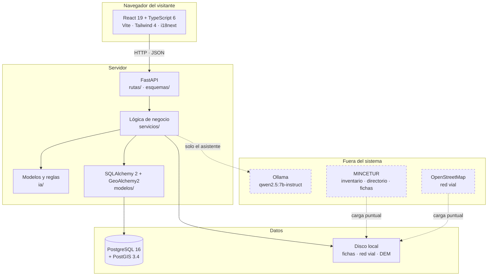
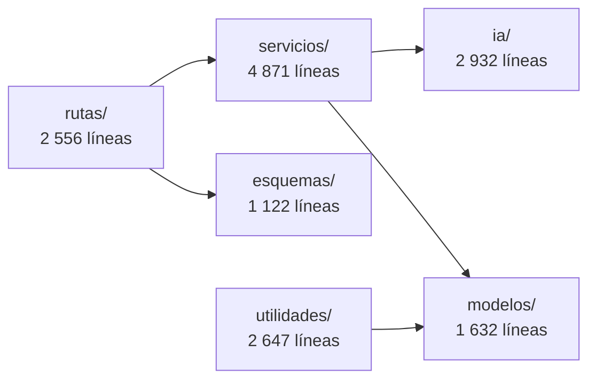
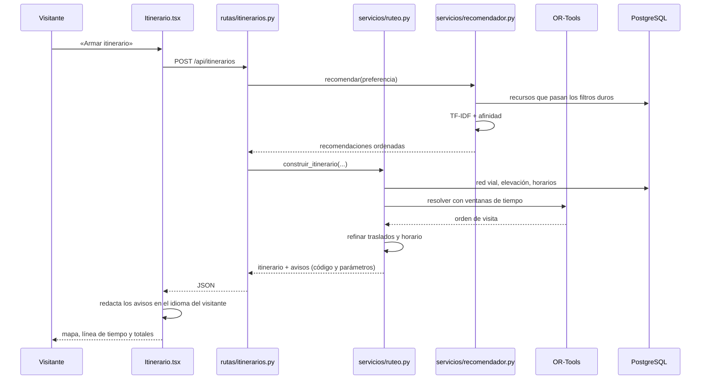

# 02 — Arquitectura

**Qué explica este archivo:** cómo está montado el sistema, qué hace cada
capa, qué tecnología se usó en cada una y por qué esa y no otra. Incluye lo
que se descartó, que suele ser lo que preguntan.

---

## La vista de conjunto



Las líneas discontinuas son **opcionales o puntuales**: Ollama puede no estar y
la aplicación funciona entera; el MINCETUR y OpenStreetMap se consultan al
cargar los datos, no en cada petición.

---

## Las capas del backend, y qué va en cada una

Es un **monolito por capas**, no microservicios. La regla que separa las capas
es sencilla: cada una solo conoce a la de abajo.



| Capa | Qué va aquí | Qué NO va aquí |
|---|---|---|
| `rutas/` | Los endpoints. Reciben, validan permisos, llaman a un servicio y devuelven. | Lógica de negocio. Si una ruta tiene un `if` que decide algo del dominio, está mal colocado. |
| `esquemas/` | Pydantic: qué entra y qué sale de la API. | Acceso a la base. |
| `servicios/` | **La lógica del dominio.** Recomendar, rutear, coordinar, agregar evidencia. | Nada de HTTP. Un servicio no sabe que existe una petición. |
| `ia/` | Modelos y sus alternativas por reglas. Puro cálculo. | Acceso a la base, salvo lectura de lo que necesita. |
| `modelos/` | SQLAlchemy: las tablas como clases. | Lógica. Un modelo describe, no decide. |
| `utilidades/` | Guiones que se ejecutan a mano: cargar datos, sembrar, verificar. | Nada que la API necesite en caliente. |

**Por qué importa esta separación:** los servicios se prueban sin levantar la
API, y la IA se prueba sin base de datos. De las 549 pruebas del backend, 267
no tocan PostgreSQL.

---

## El stack, y por qué cada pieza

### Backend

| Pieza | Versión | Por qué esta |
|---|---|---|
| **Python** | 3.14 | Lo pedía el plan. Todas las dependencias se verificaron compatibles antes de fijarlas. |
| **FastAPI** | ≥0.115 | Genera la documentación OpenAPI sola a partir del código: los 43 endpoints están en `/docs` sin escribir nada aparte. Y valida con Pydantic, que ya hacía falta. |
| **Pydantic** | v2 | Validación de entrada en todos los endpoints, que es una regla de seguridad del proyecto, no una comodidad. |
| **SQLAlchemy** | 2.0 | ORM maduro con soporte de tipos geográficos vía GeoAlchemy2. La alternativa, SQL crudo, habría hecho ilegibles las consultas espaciales. |
| **PostgreSQL + PostGIS** | 16 / 3.4 | **PostGIS es el motivo.** El proyecto calcula distancias reales sobre el elipsoide, índices espaciales GIST y centroides. Ninguna base sin extensión geográfica servía. |
| **Alembic** | ≥1.13 | Control de versiones del esquema. Hay 9 migraciones y todas se han probado en los dos sentidos. |

### Frontend

| Pieza | Versión | Por qué esta |
|---|---|---|
| **React** | 19 | Lo pedía el plan. |
| **TypeScript** | 6 | En modo estricto. Cada vez que se cambió un tipo del API, el compilador listó exactamente los sitios que había que tocar. |
| **Vite** | 8 | Arranque rápido y recarga en caliente; el proyecto se desarrolló entero con él corriendo. |
| **Tailwind CSS** | 4 | El sistema de diseño se expresa como tokens (`bg-superficie`, `text-primario`), y eso hace que el modo oscuro sea un cambio de variables y no de componentes. |
| **TanStack Query** | 5 | Caché, reintentos y estados de carga sin escribirlos a mano en cada pantalla. |
| **react-leaflet** | 5 | Mapas sin clave de API ni servicio de pago, que es una restricción del proyecto. |
| **i18next** | 26 | Los plurales. Ver [11](11-idiomas-y-avisos.md): es lo que arregló «1 valoración(es)». |
| **framer-motion** | 13 | Animaciones que respetan `prefers-reduced-motion`. |

### Lo geoespacial y la IA

| Pieza | Para qué |
|---|---|
| **scikit-learn** | TF-IDF y similitud coseno para la afinidad. |
| **OR-Tools** | 9.15. El optimizador de rutas (VRPTW con recompensas). |
| **OSMnx + NetworkX** | Descarga la red vial de OpenStreetMap y calcula caminos. |
| **rasterio** | Lee el modelo digital de elevación para el desnivel. |
| **pysentimiento** | RoBERTuito en español, para el sentimiento de las valoraciones. |
| **Ollama** | El asistente conversacional. Corre **en local**: sin nube de pago. |

---

## Qué se descartó, y por qué

Esto es lo que suelen preguntar en una defensa.

| Descartado | En favor de | Motivo |
|---|---|---|
| **Microservicios** | Monolito por capas | Un equipo de estudiantes, un despliegue. Los microservicios habrían añadido latencia entre servicios, despliegue distribuido y depuración repartida, sin resolver ningún problema que este proyecto tenga. Está prohibido explícitamente en el plan. |
| **MongoDB u otra NoSQL** | PostgreSQL + PostGIS | El dominio es fuertemente relacional (recursos, preferencias, itinerarios, paradas, solicitudes) **y** geográfico. PostGIS resuelve las dos cosas. |
| **LightGBM para la afluencia** | Reglas explícitas | Se midió: no había filas suficientes para entrenar. Ver [07](07-inteligencia-artificial.md) y `docs/decisiones/2026-08-29-por-que-se-acepto-tfidf-y-se-descarto-lightgbm.md`. |
| **Un servicio de mapas de pago** | Leaflet + OpenStreetMap | Restricción del proyecto: nada de nube de pago. |
| **Un modelo de lenguaje en la nube** | Ollama en local | La misma restricción, y además el asistente no manda datos del visitante a ningún tercero. |
| **Guardar los avisos como texto** | Código + parámetros | Ver [11](11-idiomas-y-avisos.md). Fue un cambio de la Fase 7 y arregló tres problemas a la vez. |

---

## Cómo fluye una petición

El ejemplo más completo es armar un itinerario:



**Lo que hay que notar:** los avisos salen del backend como `{codigo,
parametros}` y la frase la escribe la interfaz. Eso es lo que permite que la
aplicación entera funcione en dos idiomas.

---

## Dónde vive cada cosa

```
PROYECTO-PROCESOS-DE-SOFTWARE-/
├── backend/
│   ├── app/
│   │   ├── main.py              monta los 9 enrutadores
│   │   ├── configuracion.py     .env + interruptores de modelo
│   │   ├── base_datos.py        motor y sesiones
│   │   ├── modelos/    (8)      las tablas
│   │   ├── esquemas/   (9)      entrada y salida de la API
│   │   ├── rutas/      (9)      los 43 endpoints
│   │   ├── servicios/ (13)      la lógica del dominio
│   │   ├── ia/         (6)      modelos y alternativas por reglas
│   │   └── utilidades/(12)      guiones de carga y verificación
│   ├── alembic/versions/ (9)    migraciones
│   ├── pruebas/       (19)      549 pruebas
│   └── datos/                   descargas pesadas (ignoradas por git)
├── frontend/src/
│   ├── paginas/       (12)      una por ruta
│   ├── componentes/   (20)      piezas reutilizables
│   ├── servicios/api.ts         todas las llamadas al backend
│   ├── utilidades/              avisos.ts y formato.ts
│   ├── hooks/                   useSesion, useTema
│   ├── i18n/                    es.json y en.json (581 claves cada uno)
│   └── estilos/index.css        el sistema de diseño
├── docs/
│   ├── referencia/  ← estás aquí
│   ├── decisiones/    (14)      por qué se hizo cada cosa
│   └── indicadores/    (6)      qué mide cada indicador
├── docker-compose.yml           PostgreSQL + PostGIS
└── sonar-project.properties     preparado, NO ejecutado
```

---

## Relacionado

- [03 — Modelo de datos](03-modelo-de-datos.md)
- [04 — API](04-api.md)
- [05 — Frontend](05-frontend.md)
- `docs/decisiones/2026-08-29-sistema-de-diseno-mantaro-moderno.md`
