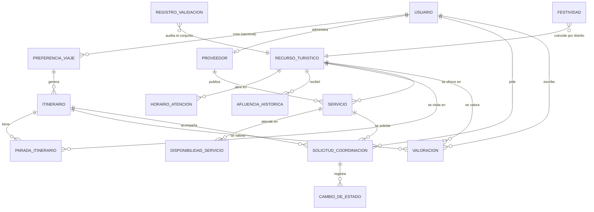
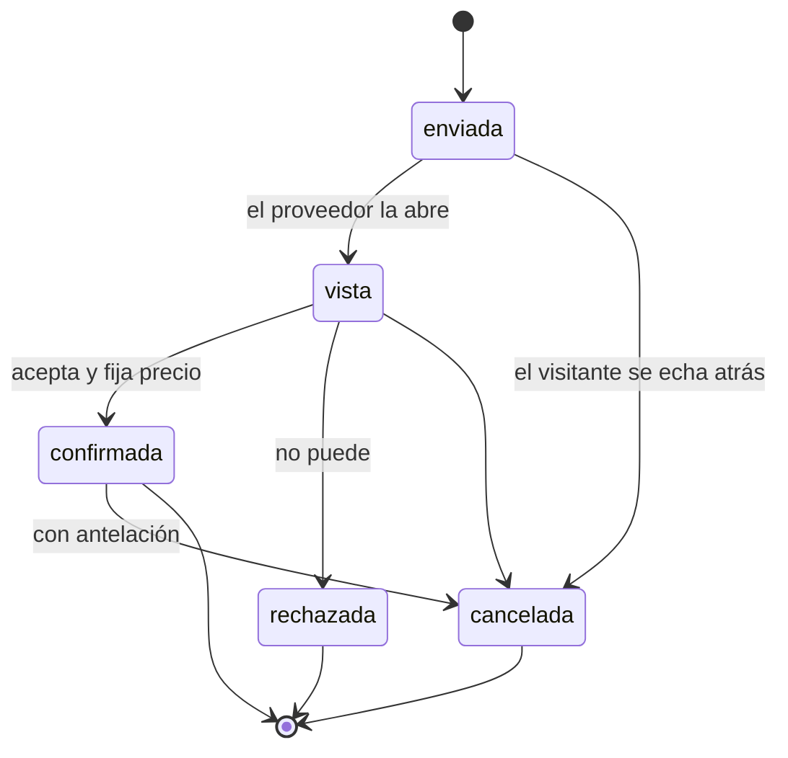

# 03 — Modelo de datos

**Qué explica este archivo:** las 17 tablas del sistema, cómo se relacionan,
qué guarda cada una y las decisiones de diseño que no son obvias mirando el
esquema.

---

## El diagrama

Las dos últimas relaciones van punteadas conceptualmente: `registro_validacion`
no apunta a un recurso concreto sino que audita el conjunto en una fecha, y
`festividad` es un calendario independiente que se cruza por distrito y fecha.

---

## Las tablas, por bloques

### Bloque 1 — El catálogo (Incremento 1)

#### `recurso_turistico` · 295 filas · 26 columnas

El corazón del sistema. Un atractivo del inventario oficial del MINCETUR.

| Grupo | Columnas | Nota |
|---|---|---|
| Identidad | `codigo_mincetur` (único), `nombre`, `provincia`, `distrito` | El código es lo que permite recargar el CSV sin duplicar. |
| Clasificación | `categoria`, `tipo`, `subtipo` | Las 5 categorías del inventario, con su número delante: «1. SITIOS NATURALES». |
| Ubicación | `ubicacion` (GEOGRAPHY POINT 4326), `altitud_msnm` | **Nula en 61 de 295.** La fuente no las trae; inventarlas sería mentir. |
| Validación | `esta_validado`, `esta_vigente`, `motivos_invalidez`, `fecha_corte` | Sostienen el indicador 1. Los no validados se **marcan**, no se ocultan. |
| De la ficha web | `descripcion_es`, `descripcion_en`, `tipo_de_ingreso`, `epoca_propicia`, `dias_de_celebracion`, `meses_de_celebracion`, `ficha_leida_en` | Añadidas en la Fase 8. Ver [06](06-fuentes-de-datos.md). |
| Otros | `url_ficha`, `foto_url`, `duracion_visita_min` | `url_ficha` estaba desde la Fase 1 y resultó ser la llave de todo lo anterior. |

**Decisiones que no son obvias:**

- **`GEOGRAPHY` y no `GEOMETRY`.** Calcula distancias reales sobre el
  elipsoide, en metros, sin reproyectar a un sistema plano.
- **El índice GIST no se declara a mano.** GeoAlchemy2 lo crea solo al crear
  la columna. Declararlo además generaba **dos índices idénticos**: ocupaban el
  doble y ralentizaban cada escritura sin aportar nada.
- **Índice de trigramas** (`gin_trgm_ops`) sobre el nombre, para el buscador
  tolerante a errores de tipeo.
- **`meses_de_celebracion` es un `ARRAY`** de enteros y no una tabla aparte:
  siempre se leen juntos y nunca se consultan por separado.

#### `horario_atencion` · 1 456 filas

Cuándo abre cada recurso, por día de la semana. **Estuvo vacía seis fases**
porque el CSV del MINCETUR no publica horarios; se llenó al leer las fichas
web. Cubre 208 de los 295 recursos.

`dia_semana` va de 0 (lunes) a 6 (domingo), **el mismo criterio que
`date.weekday()` de Python**, para no convertir en cada cálculo.

#### `registro_validacion` · 3 filas

Una fila por cada ejecución de la validación. No es una tabla auxiliar: **es
la evidencia del Incremento 1**, y lo que permite decir «el 79,32 % estaba
validado a fecha X».

---

### Bloque 2 — El visitante (Incrementos 2 y 3)

#### `usuario` · 10 filas

`hash_contrasena` con **argon2id** vía passlib. Nunca en texto plano, nunca en
los registros. Cinco roles: visitante, proveedor, operador, gestor,
administrador.

#### `preferencia_viaje` · 17 filas

Lo que el visitante responde en el asistente de seis pasos.

**`usuario_id` es nulo a propósito.** El proyecto promete que no hace falta
cuenta para armar un viaje, y esta columna nula es esa promesa hecha esquema.
Quien crea una preferencia sin sesión puede **reclamarla** después si se
registra (`POST /api/preferencias/{id}/reclamar`).

`intereses` es un `ARRAY` con ocho valores permitidos: `arqueologia`,
`artesania`, `aventura`, `ferias_fiestas`, `fotografia`, `gastronomia`,
`iglesias_conventos`, `naturaleza`.

#### `afluencia_historica` · 414 filas

Conteos de visitantes. **`mes` admite nulo**: las series del Ministerio de
Cultura vienen por mes, pero las fichas del MINCETUR dan el total del año.
Repartir un total anual entre doce sería inventarse una estacionalidad que la
fuente no mide.

`tipo_de_visitante` conserva el desglose —extranjeros, nacionales, locales—
porque sumarlo tiraría información que ya está publicada.

#### `festividad` · 69 filas (2026–2028)

El calendario del valle. `es_movil` marca las que se calculan con el algoritmo
de la Pascua (Butcher): Semana Santa, Carnavales, Corpus Christi. Las demás son
fechas fijas con su fuente citada.

---

### Bloque 3 — El itinerario (Incremento 4)

#### `itinerario` · 3 filas

**`avisos` es `JSONB`**, no texto. Guarda una lista de `{codigo, parametros}`.
Antes eran frases concatenadas con saltos de línea, lo que impedía traducirlas
y obligaba a buscar subcadenas para consultarlas. Ver
[11](11-idiomas-y-avisos.md).

**Guardar es idempotente** por preferencia y fecha: «el itinerario del día X
para la preferencia Y» es una sola cosa. Sin eso, la pantalla de valoración
creaba una fila nueva cada vez que se entraba, y el indicador 6 se diluía con
duplicados que nadie iba a valorar.

#### `parada_itinerario` · 15 filas

Cada parada con su hora de llegada y salida, y **el traslado que la precede**:
modo, tiempo, distancia, desnivel y costo mínimo y máximo.

**`origen_del_calculo`** dice si el traslado se calculó sobre la red vial real
o en línea recta corregida. Es lo que permite que el itinerario avise de que un
tramo es una estimación, en vez de presentarlo como un dato firme.

---

### Bloque 4 — La coordinación (Incrementos 5 y 6)

#### `proveedor` · 167 filas (162 reales + 5 de demostración)

**`es_demostracion` separa dos mundos:**

- `true` (5): inventados para poder enseñar el ciclo completo de solicitud y
  confirmación sin molestar a nadie real.
- `false` (162): prestadores **reales** del Directorio Nacional del MINCETUR,
  con `ruc`, `categoria`, `certificado` y `fuente`. Existen y están
  certificados por el Estado, pero **no tienen convenio con este proyecto**, y
  la interfaz lo dice.

`ruc` es único: es lo que permite recargar el directorio sin duplicar. Cuando
un negocio está en dos directorios —un hotel que también tiene restaurante
calificado— se fusionan las clases: «Hotel · Restaurante».

#### `servicio` · 6 filas

Solo los de demostración tienen servicios. A los reales **no se les inventa
capacidad, precio ni disponibilidad**: eso no está publicado.

`precio_min_soles`, `precio_max_soles` y `fecha_referencia` van siempre juntos.
Un precio sin su rango y su fecha se presentaría como firme y no lo es.

#### `solicitud_coordinacion` · 1 fila y `cambio_de_estado` · 3 filas

La solicitud tiene un `estado`, y **cada movimiento deja una fila** en
`cambio_de_estado` con quién lo hizo y cuándo. Esa tabla **es** el registro que
pide la brecha 6.

Las transiciones válidas están en una constante (`TRANSICIONES_VALIDAS`), no
repartidas por `if`. Un estado no puede saltar a cualquier otro.

#### `valoracion` · 5 filas

Guarda **tres capas**:

1. El dato crudo: `puntuacion` y `comentario`, tal como se escribieron.
2. El análisis: `sentimiento`, `confianza_sentimiento`, `temas`.
3. La trazabilidad: `analizado_por` («modelo» o «reglas») y
   `version_del_analisis`.

La capa 1 no se toca nunca. Las otras dos se pueden recalcular si el modelo
cambia, y `analizado_por` deja constancia de qué vía produjo cada fila.

Una valoración por itinerario y recurso: no se puede valorar dos veces lo mismo.

---

## Las migraciones

9 migraciones de Alembic, todas probadas en los dos sentidos.

| Migración | Qué introdujo |
|---|---|
| … | catálogo, usuarios, preferencias |
| `…festividades_y_afluencia_historica` | el calendario y las series |
| `…itinerarios_paradas_y_tarifas` | el Incremento 4 |
| `…proveedores_servicios_…` | el Incremento 5 |
| `…valoraciones_y_registro_de_…` | el Incremento 6 |
| `20260830_0100_avisos_del_itinerario_como_datos` | `avisos` de `TEXT` a `JSONB` |
| `20260830_1443_…ficha_del_mincetur` | lo que trae la ficha web |
| `20260830_1446_…directorio_del_mincetur` | los prestadores reales |
| `20260830_1452_…meses_de_celebracion` | las fechas de las fiestas |
| `20260830_1456_…totales_anuales…` | `mes` nulo y tipo de visitante |

**Una lección de las últimas:** Alembic **no detecta los cambios en las
restricciones `CHECK`**. Al hacer `mes` nulable, la columna cambió pero el
`CHECK` seguía exigiendo 1–12 y cualquier total anual habría sido rechazado.
Hubo que escribirlo a mano en la migración.

---

## Tablas vacías, y por qué

| Tabla | Por qué está vacía |
|---|---|
| `tarifa_transporte` | **No existe ninguna fuente publicada** de tarifas del valle. Los costos se estiman con una fórmula documentada y se marcan como estimación. |
| `registro_de_evidencia` | Son instantáneas históricas del tablero. Se llenan con el uso, no con la carga inicial. |

Que estén vacías es información, no un descuido: dice exactamente qué no
publica nadie.

---

## Relacionado

- [06 — Fuentes de datos](06-fuentes-de-datos.md)
- [09 — Los seis incrementos](09-los-seis-incrementos.md)
- `docs/decisiones/2026-08-29-como-se-calculan-las-tarifas-de-transporte.md`
- `docs/decisiones/2026-08-30-los-avisos-son-datos-no-frases.md`
