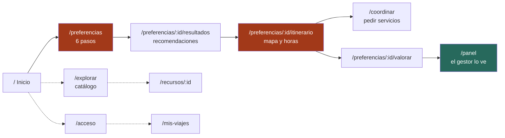

# 05 — El frontend

**Qué explica este archivo:** las 12 pantallas, los 20 componentes, cómo se
maneja el estado y la sesión, el sistema de diseño, y cómo funcionan los dos
idiomas y los dos temas.

---

## El recorrido del visitante

Lo naranja es el camino principal; lo verde, la vista del gestor. Las líneas
punteadas son ramas opcionales.

**El camino principal se puede recorrer entero sin cuenta.** Solo `/mis-viajes`
y `/panel` la exigen.

---

## Las 12 pantallas

| Ruta | Archivo | Qué hace |
|---|---|---|
| `/` | `Inicio.tsx` | Portada. El botón lleva a `/preferencias`. |
| `/explorar` | `Catalogo.tsx` | Los 295 recursos con filtros, buscador y mapa. |
| `/recursos/:id` | `DetalleRecurso.tsx` | Ficha: descripción, mapa, sello de validación, enlace a la ficha oficial. |
| `/preferencias` | `AsistentePreferencias.tsx` | **Los seis pasos.** Sin cuenta. |
| `/preferencias/:id` | `PreferenciaGuardada.tsx` | Lo que se guardó, con opción de reclamarla. |
| `/preferencias/:id/resultados` | `Resultados.tsx` | Recomendaciones con su explicación y su afluencia. |
| `/preferencias/:id/itinerario` | `Itinerario.tsx` | Mapa, línea de tiempo, totales y avisos. |
| `/preferencias/:id/valorar` | `Valorar.tsx` | Valoración de cierre. Sin cuenta. |
| `/acceso` | `Acceso.tsx` | Entrar o registrarse. Lista las cuentas de prueba. |
| `/mis-viajes` | `MisViajes.tsx` | Itinerarios guardados. **Requiere sesión.** |
| `/coordinar` | `Coordinacion.tsx` | Servicios, solicitudes y el directorio de prestadores reales. |
| `/panel` | `Panel.tsx` | Evidencia, indicadores y catálogo. **Requiere rol.** |

---

## Los 20 componentes

### Lo que hace auditable cada pantalla

| Componente | Qué muestra, y por qué importa |
|---|---|
| `TarjetaRecomendacion` | Puntaje, **qué términos lo provocaron** y qué intereses cubre. Sin eso, un «92 %» obligaría al visitante a creérselo, que es la brecha 2. Muestra además el aviso rojo cuando una fiesta no cae en el viaje. |
| `LineaDeTiempo` | Las paradas con sus horas y **los traslados entre ellas**, diciendo cuáles son estimados. |
| `TotalesDelDia` | Duración, costo, distancia y esfuerzo. El costo siempre con «aprox.». |
| `SeisIndicadores` | Los seis con **lo que cada uno no dice**. |
| `TableroDeEvidencia` | Sentimiento, temas con su % negativo, ranquin y evolución. |
| `TarjetaServicio` | Capacidad, antelación y días de atención: **lo que cierra la brecha 5**. |
| `TarjetaSolicitud` | El estado y su historial completo: **la brecha 6**. |
| `DirectorioDePrestadores` | Los 162 reales, con RUC, certificado y enlaces a teléfono, web y Google Maps. |
| `PanelConversacion` | El asistente. Muestra **qué funciones se ejecutaron** para responder. |

### Los de apoyo

`Encabezado`, `MapaRecursos`, `MapaItinerario`, `FormularioSolicitud`,
`FormularioValoracion`, `ResumenPreferencia`, `TarjetaRecurso`,
`SelectorIdioma`, `InterruptorTema`, `ProveedorSesion`, `ProveedorTema`.

---

## Cómo se maneja el estado

Tres niveles, y cada cosa está en el más bajo que le sirve:

| Nivel | Con qué | Para qué |
|---|---|---|
| **Servidor** | TanStack Query | Todo lo que viene de la API. Caché, reintentos y estados de carga sin escribirlos. |
| **Global** | Dos contextos | `ProveedorSesion` (token y usuario) y `ProveedorTema` (claro/oscuro). |
| **Local** | `useState` | Lo de una pantalla: el paso del asistente, un filtro, un formulario a medias. |

**No hay Redux ni Zustand**, y no se echan de menos: lo único global de verdad
son la sesión y el tema, y para eso dos contextos bastan.

### Las llamadas al backend

**Todas** pasan por `src/servicios/api.ts`. Ningún componente hace `fetch`
directamente. Eso concentra en un archivo la dirección del servidor, el token y
el tratamiento de errores, y es lo que permitió cambiar el formato de los
errores tocando un solo sitio.

---

## El sistema de diseño: «Mantaro Moderno»

Sale de los diseños de Stitch. Ver
`docs/decisiones/2026-08-29-sistema-de-diseno-mantaro-moderno.md`.

| Color | Valor | Significado |
|---|---|---|
| Terracota | `#a23919` | Primario. Acciones. |
| Verde valle | `#27695c` | Secundario. Confirmaciones. |
| Ocre | `#745800` | Terciario. Avisos. |

Tipografías: **Manrope** para títulos, **Be Vietnam Pro** para texto.

**Todo se expresa como tokens**, nunca como colores sueltos:
`bg-superficie-contenedor`, `text-sobre-superficie-variante`,
`border-contorno-variante`. Por eso el modo oscuro es un cambio de variables
CSS y no de componentes.

### Modo claro y oscuro

La clase `oscuro` en el elemento raíz; la preferencia se guarda en
`localStorage` bajo `rutaviva.tema`.

**Comprobado midiendo el contraste**, no mirando: se recorren las nueve rutas
en los dos temas y se cuentan los textos cuya luminancia está demasiado cerca
de su fondo. Resultado actual: **0 fallos**.

Así se encontró un fallo real: los globos que agrupan marcadores en el mapa
llevan fondo claro fijo de Leaflet, y en modo oscuro el número heredaba el
color claro de la aplicación. Claro sobre claro.

---

## Los dos idiomas

**581 claves** en `es.json` y `en.json`, que coinciden una a una.

Lo que **no** se traduce, a propósito:

- Los nombres del catálogo del MINCETUR. «Convento De Santa Rosa De Ocopa» se
  llama así en inglés también.
- La atribución de OpenStreetMap, que es obligatoria por licencia.
- Las descripciones que escriben los proveedores.

Los avisos que genera el backend **sí** se traducen: llegan como código y
parámetros. Ver [11](11-idiomas-y-avisos.md).

---

## Accesibilidad

No es un añadido: está en las pruebas.

- Cada control sin texto visible lleva `aria-label` **traducido**.
- El mapa es `aria-hidden` y va acompañado de la lista de paradas, que sí es
  navegable: un mapa de Leaflet no se puede usar con teclado.
- El panel del asistente se cierra con **Escape** y enfoca el campo al abrirse.
- Las animaciones respetan `prefers-reduced-motion`.
- La fila de días de un servicio tiene `aria-label` con los días en palabras:
  siete casillas de colores no significan nada sin vista.

---

## Cómo añadir una pantalla nueva

1. El componente en `src/paginas/`.
2. La ruta en `src/App.tsx`.
3. Los textos en `src/i18n/es.json` **y** `en.json`. Si falta uno, la prueba de
   simetría falla.
4. Si llama al backend, la función en `src/servicios/api.ts`. Nunca `fetch`
   suelto.
5. Las pruebas en `src/paginas/__pruebas__/`.
6. `npx tsc --noEmit`, `npx eslint src/`, `npx vitest run`.

---

## Relacionado

- [04 — La API](04-api.md)
- [11 — Idiomas y avisos](11-idiomas-y-avisos.md)
- [12 — Pruebas y calidad](12-pruebas-y-calidad.md)
