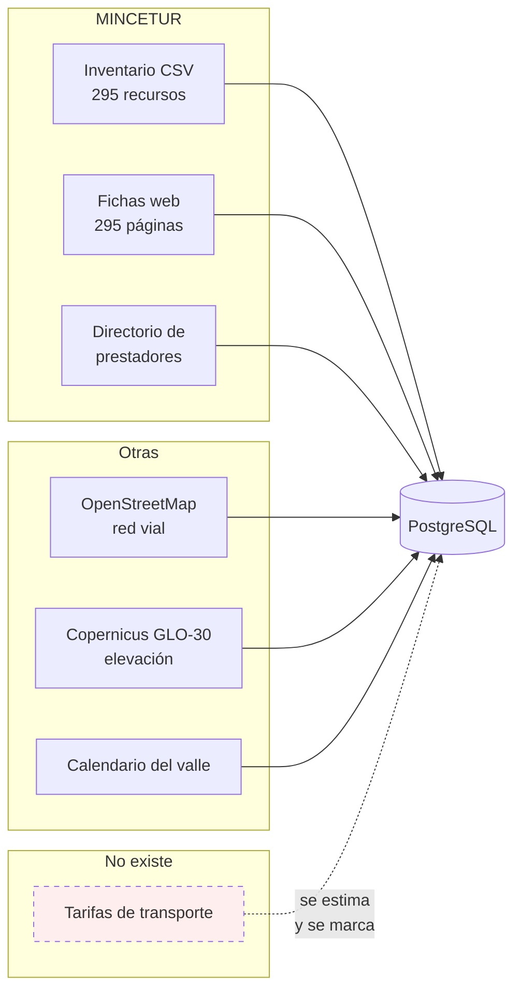

# 06 — Fuentes de datos

**Qué explica este archivo:** de dónde sale **cada dato** del sistema, qué
publica cada fuente, qué **no** publica, y qué hace el sistema cuando falta.

Es la base del argumento de honestidad del proyecto. Si en la defensa preguntan
«¿de dónde sacaste esto?», la respuesta está aquí.

---

## El principio

> **Lo que la fuente no publica se queda vacío y se dice. Nunca se rellena a
> ojo.**

Un campo vacío es información: dice exactamente qué no se sabe. Uno rellenado
con una suposición es una mentira que nadie va a poder detectar después.

Y su corolario, que costó seis fases aprender:

> **«La fuente no lo publica» hay que comprobarlo antes de escribirlo.**

Ver [15 — Historial de fallos](15-historial-de-fallos.md).

---

## Las fuentes, de un vistazo

---

## 1. Inventario Nacional de Recursos Turísticos (CSV)

| | |
|---|---|
| **Quién** | MINCETUR |
| **Qué** | 295 recursos de las cuatro provincias de la ruta |
| **Cómo se carga** | `python -m app.utilidades.cargar_catalogo` |
| **Idempotente** | Sí, por `codigo_mincetur` |

**Lo que trae:** código, nombre, provincia, distrito, categoría, tipo,
subtipo, coordenadas, altitud, fecha de corte y **la dirección de su ficha
web**.

**Lo que NO trae:** descripción, horario, precio, ni fechas de las fiestas.

**Un fallo de la fuente que hubo que corregir:** las columnas de latitud y
longitud **vienen intercambiadas**. Se detectó porque los recursos caían en el
océano. El cargador lo corrige y lo dice en su salida.

**Lo que falta y se declara:** 61 de los 295 no traen coordenadas. Se cargan
igual, marcados como no validados. Ocultarlos daría un catálogo que parece
completo y no lo está.

---

## 2. Las fichas web del inventario ⭐

| | |
|---|---|
| **Quién** | MINCETUR, el mismo sistema |
| **Qué** | Una página por recurso: `consultasenlinea.mincetur.gob.pe/fichaInventario/…` |
| **Cómo se carga** | `python -m app.utilidades.cargar_fichas` |
| **Tarda** | ~5 minutos la primera vez |

**Esta es la fuente que cambió el proyecto.** Su dirección estaba guardada en
`url_ficha` desde la Fase 1 y nadie la había abierto.

De 295 fichas leídas, **0 fallidas**:

| Dato | Cuántas lo traen |
|---|---|
| Descripción | **295** (100 %) |
| Horario de visita | **208** (71 %) |
| Tipo de ingreso | **210** (71 %) |
| Época propicia | 208 (71 %) |
| Conteos de visitantes | **207** (70 %) — 414 filas |
| Fecha de la fiesta | **28** de las 36 |

Hay recursos con **120 889 visitantes locales en 2023**.

### Cómo se lee, y por qué así

Son páginas de un servicio público del Estado. El módulo
`utilidades/fichas_mincetur.py`:

- **espera un segundo entre peticiones**;
- **guarda cada página en disco**: reejecutar no genera ni una petición;
- **se identifica** en el `User-Agent` diciendo qué es y para qué;
- **se puede reanudar** si se corta.

Las tablas se buscan **por su cabecera, no por su posición**: las fichas sin
visitantes no traen esa tabla y todo lo de abajo se corre un puesto.

### Lo que sigue faltando

El **29 % no tiene horario** ni siquiera en su ficha, y **8 de las 36 fiestas**
no precisan su fecha. Para esos, el sistema dice que no lo sabe.

---

## 3. Directorio Nacional de Prestadores Calificados

| | |
|---|---|
| **Quién** | MINCETUR, vía Plataforma Nacional de Datos Abiertos |
| **Licencia** | Open Data Commons Attribution |
| **Qué** | 162 prestadores reales de las cuatro provincias |
| **Cómo se carga** | `python -m app.utilidades.cargar_prestadores` |
| **Idempotente** | Sí, por RUC |

| Tipo | En las 4 provincias |
|---|---|
| Hospedajes | 80 |
| Agencias de viaje | 76 |
| Restaurantes calificados | 6 |

**Trae:** RUC, razón social, nombre comercial, dirección, hasta 4 teléfonos,
correo, página web, clase, categoría oficial y **número de certificado**.

**No trae:** capacidad, precios ni horarios. Por eso **no se les inventan**.

### La distinción que hay que poder defender

Estos negocios **existen y están certificados por el Estado**. Lo que **no**
tienen es ningún trato con este proyecto, y la interfaz lo dice arriba y no en
letra pequeña.

Usarlos es el mismo acto que usar el inventario de recursos: son datos que el
Estado publica sobre entidades que se registraron voluntariamente. **No es lo
mismo que rascar negocios de la web.**

**Detalle:** el mismo RUC aparece en dos directorios cuando un hotel tiene
también restaurante calificado. Se fusionan las clases —«Hotel · Restaurante»—
en vez de perder una.

---

## 4. OpenStreetMap — la red vial

| | |
|---|---|
| **Cómo se prepara** | `python -m app.utilidades.preparar_red_vial` |
| **Con qué** | OSMnx 2.1.1 + NetworkX |

Se descarga una vez y se guarda en disco. Se usa para calcular el camino real
entre dos paradas.

**Cuando no hay red cerca** (a más de 500 m del punto), se calcula la distancia
en línea recta **corregida por un índice de rodeo de 1,26**, medido para la
zona, y el traslado se marca como estimado. El itinerario avisa.

Ver `docs/decisiones/2026-08-29-cobertura-de-openstreetmap-en-el-valle.md`.

---

## 5. Copernicus GLO-30 — la elevación

| | |
|---|---|
| **Cómo se descarga** | `python -m app.utilidades.descargar_dem` |
| **Resolución** | 30 m |

Da el desnivel de cada tramo, que alimenta:

- **la función de Tobler** — `W = 6·e^(−3,5·|S+0,05|)` — para el tiempo a pie;
- el **esfuerzo del día** (suave, moderado, exigente);
- el **aviso de altitud**, que salta por encima del umbral de soroche.

El aviso de altitud es de las cosas más útiles del proyecto: Huancayo está a
3 250 m y un visitante de la costa no lo sabe.

---

## 6. El calendario de festividades

| | |
|---|---|
| **Cómo se carga** | `python -m app.utilidades.cargar_calendario --desde 2026 --hasta 2028` |
| **Qué** | 69 festividades |

Las **móviles se calculan**, no se escriben: Semana Santa, Carnavales y Corpus
Christi salen del **algoritmo de la Pascua (Butcher)**. Las fijas llevan su
fuente citada en la propia fila.

Alimenta la predicción de afluencia y la etiqueta de «hoy hay fiesta».

---

## 7. Las tarifas de transporte — **la que no existe**

**No hay ninguna fuente publicada de tarifas de transporte del Valle del
Mantaro.** Ni el MINCETUR, ni el gobierno regional, ni las municipalidades
publican precios de combi, colectivo o taxi.

Ante eso había tres opciones:

1. No dar costos. Deja al visitante sin lo que más le importa.
2. Inventar números. Prohibido por las reglas del proyecto.
3. **Estimar con una fórmula publicada, y decir que es una estimación.**

Se eligió la tercera. Todo costo lleva:

- un **rango** (`precio_min`, `precio_max`), no un número único;
- una **fecha de referencia**;
- la **fuente**, que es la propia fórmula;
- y la palabra **«aprox.»** siempre visible.

**Por qué esto no es inventar:** un número inventado no se puede discutir; una
fórmula publicada sí. Cualquiera puede mirar los parámetros y decir «esto está
mal calibrado», que es exactamente lo que se busca.

Ver `docs/decisiones/2026-08-29-como-se-calculan-las-tarifas-de-transporte.md`.

---

## Resumen: qué se sabe y qué no

| Dato | ¿Lo hay? | Fuente |
|---|---|---|
| Qué atractivos hay | ✅ 295 | Inventario MINCETUR |
| Dónde están | ⚠️ 234 de 295 | Inventario MINCETUR |
| Qué son | ✅ 295 | Fichas web |
| Cuándo abren | ⚠️ 208 de 295 | Fichas web |
| Cuánto cuesta entrar | ⚠️ 210 de 295 | Fichas web |
| Cuánta gente los visita | ⚠️ 207 de 295 | Fichas web |
| Cuándo son las fiestas | ⚠️ 28 de 36 | Fichas web |
| Qué distancia hay | ✅ | OpenStreetMap |
| Qué desnivel | ✅ | Copernicus GLO-30 |
| Cuándo hay fiesta en el valle | ✅ 69 | Calendario propio |
| Quién presta servicios | ✅ 162 | Directorio MINCETUR |
| Su capacidad y precios | ❌ | **Nadie lo publica** |
| Tarifas de transporte | ❌ | **Nadie lo publica** — se estima |

---

## Relacionado

- [03 — Modelo de datos](03-modelo-de-datos.md)
- [15 — Historial de fallos](15-historial-de-fallos.md)
- `docs/decisiones/2026-08-29-fuente-del-catalogo-mincetur.md`
- `docs/decisiones/2026-08-30-la-ficha-web-traia-lo-que-el-csv-no.md`
