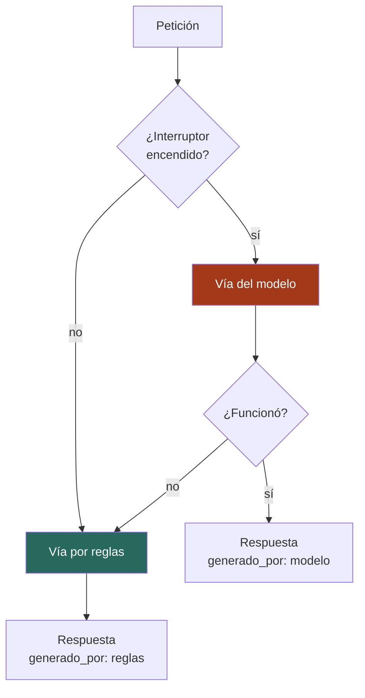

# 07 — La inteligencia artificial

**Qué explica este archivo:** los cuatro usos de IA del sistema, la alternativa
por reglas que cada uno tiene, y **las mediciones** con las que se aceptó o se
rechazó cada modelo.

Nada de esto se decidió por opinión. Cada aceptación y cada rechazo tienen un
número detrás, y ese número está aquí.

---

## La regla de oro

> **Toda funcionalidad con modelo tiene una alternativa por reglas explícitas,
> conmutable con una variable del `.env`.**

No es una precaución teórica: se ejecuta. Con el interruptor apagado, la vía
por reglas responde y el sistema **declara cuál usó** en el campo
`generado_por` o `calculado_por` de cada respuesta.

```env
USAR_MODELO_RECOMENDACION=true
USAR_MODELO_AFLUENCIA=true
USAR_MODELO_SENTIMIENTO=true
```

**Por qué existe esta regla.** Un modelo puede fallar, no estar instalado, o
resultar peor que unas reglas simples. Si el sistema depende de él sin salida,
un fallo del modelo es un fallo del producto. Y en un proyecto académico hay
una razón más: obliga a **medir** si el modelo aporta algo, porque hay algo con
lo que compararlo.



---

## 1. Recomendación — TF-IDF **aceptado**

| | |
|---|---|
| **Dónde** | `app/ia/afinidad.py`, `app/servicios/recomendador.py` |
| **Modelo** | TF-IDF + similitud coseno (scikit-learn) |
| **Reglas** | Coincidencia por palabras clave de interés |
| **Interruptor** | `USAR_MODELO_RECOMENDACION` |

**Qué hace:** convierte el texto de cada recurso —nombre, categoría, tipo,
descripción— y los intereses del visitante en vectores, y ordena por similitud.

**Por qué se aceptó:** encuentra relaciones que las palabras clave no ven. Un
visitante interesado en «artesanía» recibe el «Pueblo Artesanal de Cochas
Chico» aunque su ficha no repita la palabra, porque comparte términos como
«artesanal», «taller» y «mate burilado».

**Lo que lo hace auditable:** cada recomendación devuelve
`terminos_decisivos`, las palabras que más pesaron. Sin eso, un «92 %» sería
una cifra que el visitante tiene que creerse, que es exactamente la brecha 2.

Ver `docs/decisiones/2026-08-29-por-que-se-acepto-tfidf-y-se-descarto-lightgbm.md`.

---

## 2. Afluencia — LightGBM **rechazado**

| | |
|---|---|
| **Dónde** | `app/ia/afluencia.py` |
| **Modelo** | LightGBM (instalado, **no en uso**) |
| **Reglas** | Calendario: feria dominical, festividades, feriados, fin de semana, temporada |
| **Interruptor** | `USAR_MODELO_AFLUENCIA` |

**Por qué se rechazó, con el número:** hacen falta al menos
`FILAS_MINIMAS_PARA_ENTRENAR` filas históricas y **no las había**. El Ministerio
de Cultura publica series de visitantes, pero apenas cubren recursos del Valle
del Mantaro.

El código **no esconde el rechazo**: si se le pide entrenar sin datos
suficientes, devuelve un `ResultadoEntrenamiento` con `se_entreno=False` y el
motivo escrito.

> Entrenar un modelo con cuatro datos y presentarlo como si valiera es
> exactamente lo que este proyecto dice no hacer.

**Lo que sí hace la vía por reglas:** siete reglas ordenadas por prioridad,
cada una con su motivo. Y **el motivo no es decorativo**: sin él, «va a haber
mucha gente» es una afirmación que el visitante tiene que creerse.

| Regla | Nivel |
|---|---|
| Feria Dominical en Huancayo | alto |
| Festividad en el distrito | alto |
| Feriado nacional | alto |
| Faltan ≤3 días para una festividad | medio |
| Fin de semana | medio |
| Temporada alta | medio |
| Día laborable fuera de temporada | bajo |

**Novedad de la Fase 8:** ahora hay **414 conteos reales de visitantes** de las
fichas del MINCETUR. Eso no cambia la decisión —siguen siendo pocos para
entrenar— pero es la primera vez que hay datos reales con los que contrastar.

---

## 3. Sentimiento — pysentimiento **aceptado, y medido dos veces**

| | |
|---|---|
| **Dónde** | `app/ia/sentimiento.py` |
| **Modelo** | pysentimiento 0.7.3 (RoBERTuito, español) |
| **Reglas** | 61 palabras positivas, 59 negativas, negadores, 9 temas |
| **Interruptor** | `USAR_MODELO_SENTIMIENTO` |

**Esta es la medición más instructiva del proyecto, porque la primera estaba
mal.**

### La comparación amañada

La primera medición dio **reglas 13/13 vs modelo 11/13**. Parecía que las
reglas ganaban.

Estaba mal: **las reglas veían la puntuación en estrellas y el modelo no.**
Estaba comparando «reglas con una pista» contra «modelo sin ella».

### La comparación honesta

Solo con el texto, sin la puntuación:

| Vía | Acierto |
|---|---|
| Reglas | **8 / 14** |
| Modelo | **11 / 14** |

El modelo gana claramente cuando se le juzga con las mismas condiciones.

### La solución

Se le da también la puntuación al modelo, con un **umbral de confianza de
0,70** medido: por debajo de eso, la puntuación manda; por encima, el modelo
puede contradecirla.

Resultado final: **13/13 con puntuación**, **12/14 solo con texto**.

**Un detalle que se afinó:** un 3★ no es «sin señal». Es una opinión tibia, y
contradecirla exige la misma confianza que contradecir un 5★.

Ver `docs/decisiones/2026-08-29-por-que-se-acepto-pysentimiento.md`.

---

## 4. Ruteo — OR-Tools **aceptado, y calibrado**

| | |
|---|---|
| **Dónde** | `app/servicios/ruteo.py` |
| **Modelo** | OR-Tools 9.15, VRPTW con recompensas |
| **Reglas** | Vecino más cercano |
| **Interruptor** | No lo tiene: si OR-Tools no encuentra solución, **cae solo** a las reglas y lo avisa |

**Por qué se aceptó, con el número:** sobre el mismo conjunto, OR-Tools
consiguió **302 de afinidad acumulada** frente a **263** del vecino más
cercano. Un 15 % mejor, con las mismas restricciones de tiempo y presupuesto.

**Calibración medida, no supuesta.** Las constantes del archivo llevan la tabla
con la que se eligieron:

| Constante | Valor | Cómo se eligió |
|---|---|---|
| `PESO_DE_LA_AFINIDAD` | 3 | Por encima de 3 la afinidad se satura en 302 |
| `SEGUNDOS_DE_BUSQUEDA` | 2 | Resultados idénticos a 1, 2, 3 y 5 s |
| `MAXIMO_CANDIDATOS` | 20 | La matriz crece con el cuadrado |
| `PROPORCION_DE_TRASLADO` | 0,35 | El resto se reserva para entradas y comida |

**El fallo que hubo que arreglar:** `RoutingIndexManager(n, 1, 0)` fuerza al
vehículo a volver al inicio. Un itinerario turístico **no es un tour cerrado**:
no vuelves al primer sitio. Devolvía 1 parada donde las reglas encontraban 3.
Se arregló con un nodo final virtual, y hay dos pruebas de regresión que lo
fijan.

Ver `docs/decisiones/2026-08-29-por-que-se-acepto-or-tools-y-como-se-calibro.md`.

---

## Y lo que no es IA aunque lo parezca

**La función de Tobler** (`app/ia/tiempo_recorrido.py`) calcula la velocidad a
pie según la pendiente:

```
W = 6 · e^(−3,5 · |S + 0,05|)
```

Es una **fórmula empírica publicada** (Tobler, 1993), no un modelo entrenado.
Está en la carpeta `ia/` por cercanía temática, pero no tiene alternativa por
reglas ni interruptor: no la necesita, porque es determinista y no aprende de
nada.

Es la que hace que subir 200 m no cueste lo mismo que bajarlos.

---

## Cómo comprobar la regla de oro en la defensa

```bash
cd backend
.venv/Scripts/python.exe -c "
from app.ia.sentimiento import analizar
frase = 'El lugar es precioso pero la atencion fue lentisima.'
for usar in (True, False):
    r = analizar(frase, puntuacion=3, usar_modelo=usar)
    print(('MODELO' if usar else 'REGLAS'), r.sentimiento.value, r.confianza)
"
```

Las dos vías responden. Y cada respuesta del API declara cuál se usó, así que
no hay que creerse nada.

---

## Relacionado

- [08 — El asistente conversacional](08-asistente-conversacional.md)
- [10 — Los indicadores](10-indicadores.md)
- `docs/decisiones/` — las cuatro notas de decisión de modelos
