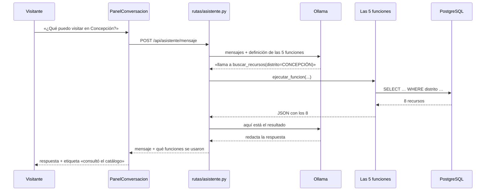

# 08 — El asistente conversacional

**Qué explica este archivo:** cómo funciona el asistente con Ollama, por qué
arquitectónicamente **no puede inventar datos**, y cómo demostrarlo en una
defensa.

---

## Lo primero, y lo que más importa decir

> **El asistente no cierra ninguna brecha nueva. Es capa de interacción, no
> funcionalidad nueva.**

Es una forma alternativa de llegar a lo que ya construyeron los Incrementos 2,
3 y 4. **Todo lo que permite pedir hablando se puede pedir por formulario.**

Presentarlo como «la innovación del proyecto» sería exagerar: si mañana se
apaga Ollama, **no se pierde ninguna capacidad del sistema**. Se pierde una
manera cómoda de pedir las cosas.

La comprobación es sencilla: cuando el asistente no está disponible, la
interfaz enseña un enlace al formulario. **Si cerrara una brecha, ese enlace no
podría existir.**

Ver `docs/decisiones/2026-08-29-el-asistente-no-cierra-ninguna-brecha.md`.

---

## Cómo funciona

| | |
|---|---|
| **Motor** | Ollama, **en local**. Sin nube de pago. |
| **Modelo** | `qwen2.5:7b-instruct` (~4,4 GB) |
| **Código** | `app/ia/asistente.py`, `app/rutas/asistente.py` |
| **Interfaz** | `PanelConversacion.tsx`, botón flotante en todas las pantallas |
| **Velocidad** | 25–40 s por respuesta en CPU sin GPU dedicada |



---

## Por qué no puede inventar datos

**No es una promesa: es una consecuencia de la arquitectura.**

El modelo **no sabe nada** del Valle del Mantaro. No conoce sus atractivos, ni
sus precios, ni sus horarios. Lo único que hace es:

1. Leer lo que pide el visitante.
2. **Elegir qué función del backend responde a eso.**
3. Redactar **con lo que devolvió esa función**.

Las cinco funciones consultan la base de datos:

| Función | Qué hace |
|---|---|
| `buscar_recursos` | Busca en el catálogo del MINCETUR |
| `crear_preferencia` | Registra las preferencias del viaje |
| `generar_recomendaciones` | Las recomendaciones de una preferencia |
| `construir_itinerario` | El itinerario de un día |
| `consultar_afluencia` | La afluencia esperada de una fecha |

El modelo **solo ve el JSON que devuelven**. Si pregunta por un lugar que no
está en el catálogo, la búsqueda devuelve cero y en el mismo JSON viaja un
aviso escrito en palabras:

> «No hay ningún recurso con esos criterios en el Inventario Nacional de
> Recursos Turísticos del MINCETUR. NO inventes uno y **NO propongas ningún
> otro lugar de memoria**: cualquier alternativa que sugieras tiene que salir
> de una nueva llamada a `buscar_recursos`.»

### Las seis reglas del mensaje de sistema

1. Nunca inventar atractivos, precios, horarios ni distancias. **Ni proponer un
   lugar «parecido» de memoria.**
2. **Llamar siempre a `buscar_recursos` antes de contestar** sobre un lugar
   concreto, aunque creas saber la respuesta.
3. El catálogo es del MINCETUR: si algo no está ahí, para esta plataforma no
   existe.
4. Los precios son **estimaciones**, y hay que decirlo.
5. Si no se puede responder con las funciones, decirlo con claridad.
6. Responder en el idioma en que te escriban.

---

## La prueba que hay que enseñar

Pídele **un lugar que no existe**:

```
Quiero visitar el Palacio de la Cultura de Jauja, ¿cómo llego?
```

**Resultado real:**

```
FUNCIONES: buscar_recursos({"distrito": "JAUJA", "texto": "Palacio de la Cultura"})
RESPUESTA: Lo siento, pero no encontramos un recurso con ese nombre en el
           catálogo. Puedo ayudarte a buscar atractivos turísticos en Jauja
           o por categorías. ¿Te interesa buscar por algo en particular?
```

Consulta primero, no lo encuentra, lo dice, **y no propone ningún sustituto
inventado**. En la base no hay ninguna fila cuyo nombre contenga «Palacio» y
«Cultura».

Compáralo con uno que sí existe: `Busca el Convento de Ocopa`.

---

## Lo que hace la conversación auditable

Debajo de cada respuesta, la interfaz muestra **qué funciones se ejecutaron**,
traducidas: «consultó el catálogo», «armó el itinerario».

No es un adorno técnico. Si pone «consultó el catálogo», esa respuesta salió de
la base de datos. **Y si no pone nada, significa que el modelo respondió sin
consultar**, que es información honesta: esa respuesta no está respaldada.

---

## Los tres fallos que aparecieron usándolo

Ninguno lo encontró una prueba. Los tres salieron preguntándole cosas normales.

### 1. Acertaba por casualidad

La primerísima prueba fue el «Palacio de la Cultura de Jauja». Respondió que no
lo encontraba **con la lista de funciones vacía**: nunca consultó nada. Dijo la
verdad por suerte, y con la misma seguridad habría podido decir lo contrario.

De ahí salió la regla 2.

### 2. Negaba lo que sí existe

A «¿qué puedo visitar en Concepción?» respondió que no había recursos
registrados. **Hay trece.** El modelo escribe «CONCEPCIÓN» con tilde y el
inventario la guarda sin ella.

Es el peor tipo de fallo posible aquí: no es inventar, es **negar**, y con
aplomo. Se arregló normalizando los dos lados con `unaccent`.

### 3. El vacío empuja a inventar

A «busca el Convento de Ocopa» respondió que no estaba, y **se ofreció a
recomendar «el Convento de San Francisco en Huancayo»**, sacado de su memoria.

Dos causas encadenadas: se buscaba la frase literal —el inventario lo llama
«Convento De Santa Rosa De Ocopa»— y el modelo mandó `categoria=
"iglesias_conventos"`, que es un código de interés y no una categoría del
MINCETUR.

> **La lección que se llevó al código:** una búsqueda vacía por un filtro mal
> escrito no es un resultado neutro. Es **el escenario que empuja al modelo a
> rellenar el hueco**. Por eso ahora un filtro desconocido se ignora en vez de
> aplicarse: devolver de más es un problema menor que devolver nada.

---

## Cuando Ollama no está

`GET /api/asistente/estado` devuelve `disponible: false` y el motivo.
`POST /api/asistente/mensaje` devuelve **200**, no un error, con
`esta_disponible: false`.

La interfaz muestra el motivo técnico —para quien tenga que arreglarlo— y un
enlace al formulario.

> Un asistente que no responde y no explica por qué es peor que uno que
> directamente no está: el visitante se queda esperando sin saber que espera en
> vano.

---

## Las pruebas

**33 pruebas**, y **ninguna necesita Ollama levantado**. Es a propósito.

El asistente tiene dos mitades: las **funciones del backend**, que son código
normal y se prueban como cualquier cosa, y el **modelo**, que no es
determinista y no se puede fijar con un `assert`.

Todo lo que se prueba es de la primera mitad — que es justo la que sostiene la
promesa, porque el modelo solo puede hablar de lo que esas funciones devuelvan.

---

## Lo que sigue sin resolver

- **Tarda 25–40 s** en CPU. Es el coste de correr 7 000 millones de parámetros
  sin GPU. En una demostración en vivo, ten preparada una respuesta de respaldo.
- **Puede elegir mal la función.** Que no invente datos no significa que
  siempre acierte: puede devolver datos reales que no responden a la pregunta.
  La lista de funciones ejecutadas existe justamente para que eso se vea.
- **No hay pruebas automáticas del modelo.** Fijar con un `assert` lo que
  responde un modelo de lenguaje exigiría fijar su semilla y su versión, y aun
  así sería frágil.

---

## Relacionado

- [07 — La inteligencia artificial](07-inteligencia-artificial.md)
- [14 — Guion de defensa](14-guion-de-defensa.md)
- `docs/decisiones/2026-08-29-el-asistente-no-cierra-ninguna-brecha.md`
