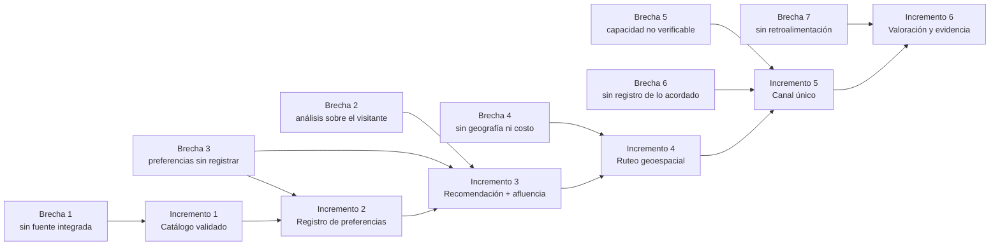

# 09 — Los seis incrementos

**Qué explica este archivo:** brecha por brecha, qué se construyó, dónde está
el código, qué pruebas lo sostienen y qué indicador lo mide.

Es la **matriz de trazabilidad**: de una brecha del análisis a una línea de
código y a una prueba que la fija. Es lo que se pide en un documento académico
cuando hay que demostrar que el software responde al análisis.

---

## La vista de conjunto

---

## Incremento 1 — Catálogo único validado

**Cierra la brecha 1:** *no existe una fuente integrada, oficial y actualizada
de la oferta de la ruta.*

| | |
|---|---|
| **Qué se construyó** | Importación del inventario del MINCETUR, validación automática y catálogo consultable con mapa |
| **Código** | `servicios/catalogo.py`, `servicios/validacion_catalogo.py`, `utilidades/cargar_catalogo.py` |
| **Tablas** | `recurso_turistico`, `horario_atencion`, `registro_validacion` |
| **Endpoints** | 5 de catálogo |
| **Pantallas** | `/explorar`, `/recursos/:id` |
| **Pruebas** | `test_catalogo.py`, `test_validacion_catalogo.py`, `test_rutas_catalogo.py` |
| **Indicador** | 79,32 % validado (234 de 295) |

**Qué significa «validado»:** que pasa las comprobaciones automáticas de
coordenadas, provincia y vigencia. **No** significa que alguien haya ido a
comprobarlo sobre el terreno.

**Lo que no se hizo, y es deliberado:** los 61 recursos sin coordenadas **no se
ocultan**. Se cargan marcados. Ocultarlos daría un catálogo que parece completo
y no lo está.

---

## Incremento 2 — Registro de preferencias

**Cierra la brecha 3:** *las preferencias del visitante no se registran ni se
usan sistemáticamente.*

| | |
|---|---|
| **Qué se construyó** | Asistente de seis pasos, sin necesidad de cuenta |
| **Código** | `rutas/preferencias.py`, `servicios/usuarios.py`, `servicios/seguridad.py` |
| **Tablas** | `preferencia_viaje`, `usuario` |
| **Endpoints** | 6 de preferencias, 3 de autenticación |
| **Pantallas** | `/preferencias`, `/preferencias/:id`, `/acceso`, `/mis-viajes` |
| **Pruebas** | `test_rutas_preferencias.py`, `test_rutas_autenticacion.py`, `test_seguridad.py` |
| **Indicador** | Preferencias que llegan a itinerario |

**La decisión que define este incremento:** funciona **sin cuenta**. Obligar a
registrarse antes de dejar probar nada es la forma más rápida de que nadie
pruebe. Quien luego se registra puede **reclamar** su preferencia.

Ver `docs/decisiones/2026-08-29-la-aplicacion-funciona-sin-cuenta.md`.

---

## Incremento 3 — Recomendación y afluencia

**Cierra las brechas 2 y 3:** *el análisis y la priorización recaen en el
visitante, sin criterios explícitos.*

| | |
|---|---|
| **Qué se construyó** | Recomendador TF-IDF con explicación, y predicción de afluencia con calendario |
| **Código** | `ia/afinidad.py`, `ia/afluencia.py`, `ia/calendario.py`, `servicios/recomendador.py` |
| **Tablas** | `afluencia_historica`, `festividad` |
| **Endpoints** | `POST /api/recomendaciones`, 2 de calendario |
| **Pantallas** | `/preferencias/:id/resultados` |
| **Pruebas** | `test_afinidad_y_afluencia.py`, `test_calendario.py`, `test_rutas_recomendaciones.py` |
| **Indicador** | 100 % sin error |

**Lo que cierra la brecha, y hay que saber decir:** no es recomendar. Es
**recomendar explicando**. Cada tarjeta muestra qué términos pesaron y qué
intereses cubre. Una recomendación sin criterios explícitos deja la brecha 2
abierta aunque acierte.

**La lista de descartados** hace auditable el filtrado: el visitante puede ver
qué **no** se le está enseñando y por qué.

---

## Incremento 4 — Ruteo geoespacial multimodal

**Cierra la brecha 4:** *el proceso no incorpora la distribución geográfica ni
el tiempo y costo de desplazamiento.*

| | |
|---|---|
| **Qué se construyó** | Itinerario de un día con orden optimizado, horas, distancias, desnivel y costo |
| **Código** | `servicios/ruteo.py` (~1 400 líneas), `red_vial.py`, `elevacion.py`, `costos.py`, `ia/tiempo_recorrido.py` |
| **Tablas** | `itinerario`, `parada_itinerario`, `tarifa_transporte` |
| **Endpoints** | 4 de itinerarios |
| **Pantallas** | `/preferencias/:id/itinerario` |
| **Pruebas** | `test_ruteo.py`, `test_rutas_itinerarios.py`, `test_tiempo_recorrido.py`, `test_costos.py` |
| **Indicador** | 4 de 4 perfiles, peor caso 5,05 s de 10 s |

**Es el incremento con más piezas:** OR-Tools para el orden, OpenStreetMap para
las distancias, Copernicus para el desnivel, Tobler para el tiempo a pie, y una
fórmula documentada para el costo.

**Lo que lo hace honesto:** cada traslado dice si se calculó sobre la red vial
real o en línea recta corregida, y el itinerario avisa cuando hay estimaciones.

---

## Incremento 5 — Canal único de coordinación

**Cierra las brechas 5 y 6:** *la capacidad del proveedor no es verificable al
decidir* y *no existe punto único ni registro de lo acordado.*

| | |
|---|---|
| **Qué se construyó** | Servicios con capacidad y horarios, comprobación previa, solicitudes con estados y registro de cada cambio |
| **Código** | `servicios/coordinacion.py`, `rutas/coordinacion.py`, `utilidades/cargar_prestadores.py` |
| **Tablas** | `proveedor`, `servicio`, `disponibilidad_servicio`, `solicitud_coordinacion`, `cambio_de_estado` |
| **Endpoints** | 14 |
| **Pantallas** | `/coordinar`, `/panel` |
| **Pruebas** | `test_coordinacion.py` |
| **Indicador** | 1 canal (antes 3 o más) |

**Brecha 5 — la capacidad verificable:** antes había que llamar para saber si
un taller podía atender a doce personas un sábado. Ahora
`POST /api/servicios/{id}/disponibilidad` lo dice **antes de enviar nada**, y
devuelve **todos** los motivos, no el primero.

**Brecha 6 — el registro:** cada movimiento de una solicitud deja una fila en
`cambio_de_estado` con quién y cuándo. Esa tabla **es** el registro.

**Novedad de la Fase 8:** además de los 5 proveedores de demostración hay
**162 prestadores reales** del directorio del MINCETUR. Certificados por el
Estado, sin convenio con el proyecto, y se dice.

---

## Incremento 6 — Valoración de cierre y evidencia

**Cierra la brecha 7:** *la retroalimentación no retorna estructurada al
proceso ni al gestor.*

| | |
|---|---|
| **Qué se construyó** | Valoración con análisis de sentimiento y temas, y tablero de evidencia para el gestor |
| **Código** | `ia/sentimiento.py`, `servicios/evidencia.py`, `rutas/valoraciones.py` |
| **Tablas** | `valoracion`, `registro_de_evidencia` |
| **Endpoints** | 4 |
| **Pantallas** | `/preferencias/:id/valorar`, `/panel` |
| **Pruebas** | `test_sentimiento.py`, `test_valoraciones.py` |
| **Indicador** | 100 % de itinerarios valorados |

**Lo que distingue esto de «mostrar reseñas»:** un listado de comentarios no es
evidencia, es trabajo pendiente para quien lo lea. El tablero agrega **por
tema, por recurso y por tiempo**, y el número que importa es el **% negativo
por tema**: es el que dice **dónde actuar**.

**Y avisa cuando no hay datos suficientes** para fiarse, antes de enseñar los
números.

---

## La matriz completa

| Brecha | Incr. | Endpoints | Tablas | Archivo de pruebas | Indicador |
|---|---|---|---|---|---|
| 1 | 1 | 5 | 3 | `test_catalogo`, `test_validacion_catalogo` | 79,32 % |
| 3 | 2 | 9 | 2 | `test_rutas_preferencias`, `test_seguridad` | preferencias → itinerario |
| 2 y 3 | 3 | 3 | 2 | `test_afinidad_y_afluencia`, `test_calendario` | 100 % sin error |
| 4 | 4 | 4 | 3 | `test_ruteo`, `test_tiempo_recorrido`, `test_costos` | 4 de 4 perfiles |
| 5 y 6 | 5 | 14 | 5 | `test_coordinacion` | 1 canal |
| 7 | 6 | 4 | 2 | `test_sentimiento`, `test_valoraciones` | 100 % valorados |
| — | *(Fase 7)* | 2 | — | `test_asistente` | *no aplica* |

**La última fila es importante:** el asistente **no tiene brecha ni indicador**
porque no cierra ninguna. Es capa de interacción. Ver [08](08-asistente-conversacional.md).

---

## Relacionado

- [01 — Visión y contexto](01-vision-y-contexto.md)
- [10 — Los indicadores](10-indicadores.md)
- `docs/indicadores/` — una nota por indicador
