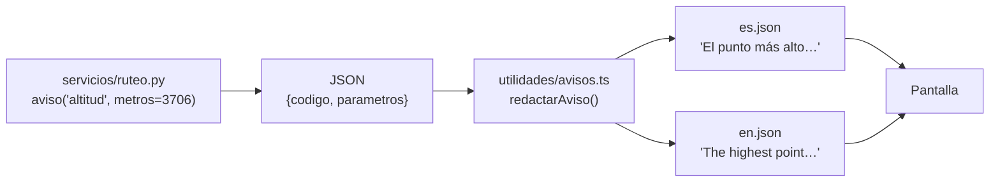

# 11 — Idiomas y avisos

**Qué explica este archivo:** cómo se consiguió que la aplicación **entera**
funcione en dos idiomas, incluidos los avisos que genera el backend, y por qué
ese cambio arregló tres problemas a la vez.

---

## El problema que lo destapó

Recorriendo la aplicación en inglés apareció esto:

> **Before you set out**
> *El punto más alto del día está a 3706 m s. n. m.*

Las 467 cadenas de la interfaz estaban traducidas. Estas no, porque **no eran
cadenas de la interfaz**: eran frases que el backend construía y mandaba ya
escritas.

Y arrastraba un segundo problema que llevaba meses dando la lata: **los
plurales**. Cuando el backend redacta, cada frase concuerda a mano, y se
colaban cosas así:

- «Solo hay 1 valoración(es)»
- «1 de los 1 recursos valorados **tienen** menos de 5 valoraciones»
- «El servicio atiende como máximo a 1 persona(s)»
- «Ese día quedan 1 plaza(s)»

Se arreglaban de una en una y volvían en la siguiente frase que alguien
escribía con prisa.

---

## La solución: un aviso es un dato, no una frase

El backend dejó de redactar. Ahora manda **un código y sus datos**:

```json
{ "codigo": "altitud", "parametros": { "metros": 3706 } }
```

Y la interfaz escribe la frase con i18next.



| Mitad | Dónde vive | Qué decide |
|---|---|---|
| **Código y parámetros** | `backend/app/servicios/avisos.py` | «Hay algo que decir aquí» |
| **La frase** | `frontend/src/i18n/{es,en}.json` | «Cómo se dice» |

Son **67 códigos**, agrupados por origen: itinerario, recomendaciones,
afluencia, tablero, coordinación y errores.

---

## Los tres problemas que resolvió a la vez

### 1. La traducción

Obvia: la frase se elige según el idioma.

### 2. Los plurales

i18next los resuelve con sus formas `_one` y `_other`:

```json
"pocas_valoraciones_one":   "Solo hay {{count}} valoración. …",
"pocas_valoraciones_other": "Solo hay {{count}} valoraciones. …"
```

Y **acierta en inglés sin escribir dos veces la frase**, en idiomas cuyas
reglas de plural no son las del español.

### 3. Las pruebas — la consecuencia que no se buscaba

Antes las pruebas decían:

```python
assert any("no traen comentario" in a for a in cuerpo["avisos"])
```

Eso se rompía al cambiar una coma. Peor: **fijaba la redacción**, así que
arreglar la concordancia de una frase rompía pruebas que no tenían nada que ver.

Pasó de verdad: al corregir «no traen» por «no trae» se cayó una prueba que
llevaba tiempo **fijando la falta de concordancia**.

Ahora dicen:

```python
assert "valoraciones_sin_comentario" in codigos(cuerpo["avisos"])
assert parametros_de(avisos, "recursos_poco_fiables")["total"] == 1
```

**Un aviso dejó de ser texto y pasó a ser un dato.** Se puede preguntar a la
base cuántos itinerarios avisaron de altitud sin buscar subcadenas.

---

## Las tres decisiones internas

### 1. Tres códigos para los horarios, no uno con parámetros

Las tres frases no cambian solo de número, cambian de **sujeto**: «el único»,
«ninguno de los N», «N de los M». Una sola plantilla parametrizada da frases
forzadas en español y peores en inglés.

Son `sin_horario_el_unico`, `sin_horario_ninguno` y `sin_horario_algunos`.

### 2. El nombre y la salvedad de los indicadores no viajan

El nombre del indicador 1 es siempre «Oferta validada y vigente». Mandarlo en
cada respuesta era mandar **una constante en español** que después no se podía
traducir. Ahora la tarjeta los busca por el número: `indicadores.1.nombre`,
`.brecha`, `.salvedad`.

Lo único que viaja es lo que cambia con los datos.

### 3. Un parámetro numérico no siempre es «la cantidad»

i18next elige el plural mirando un parámetro llamado exactamente `count`. El
backend nombra los suyos por lo que significan: `cuantas`, `validados`,
`libres`. Son mejores nombres.

La interfaz copia el primer numérico como `count`… pero **no todos valen**. En
«1 de 3 recursos valorados», lo que decide singular o plural es el **1**, no el
3. Por eso hay una lista de parámetros que son **referencias y no cantidades**:
`total`, `cupo`, `minimo`, `pedidas`, `dia`, `metros`, `subida`.

Sin esa lista salía «1 de los 3 recursos valorados **tienen**».

---

## Lo que impide que esto se rompa

Una prueba del frontend lee la lista de códigos **del propio archivo de
Python** y comprueba que cada uno tiene su frase en los dos idiomas:

`frontend/src/utilidades/__pruebas__/avisos.prueba.ts`

Duplicar la lista ahí habría sido copiar lo que se quiere comprobar. También
falla al revés: una frase sin código que la use es código muerto.

Y en el backend, `aviso()` **rechaza cualquier código no declarado** en
`CODIGOS_CONOCIDOS`, así que el error salta al construirlo y no en una
respuesta HTTP a medio camino.

---

## Los errores también

```json
{ "detail": { "codigo": "credenciales_incorrectas" } }
```

`traducirError()` maneja tres casos:

1. **Código del backend** → se traduce.
2. **Varios motivos** (el 409 de coordinación) → se redactan y se juntan.
3. **De Pydantic** → ya viene redactado por la biblioteca; se deja pasar.

El tercero es la razón de que esto no sea un `t()` a secas: buscar una
traducción que no existe devolvería la clave cruda y perdería un mensaje útil.

---

## El coste

- **Una migración**: `itinerario.avisos` de `TEXT` a `JSONB`. Los avisos ya
  guardados se pierden —de una frase en español no se puede deducir qué código
  la produjo— pero se recalculan al abrir el itinerario.
- **42 pruebas hubo que reescribir.** Ninguna perdió cobertura: la mayoría
  quedó comprobando algo más preciso.
- **Un archivo de idioma más largo:** 581 claves por idioma, frente a 467.

---

## Lo que sigue en un solo idioma, y por qué

- **Los nombres del catálogo.** «Convento De Santa Rosa De Ocopa» se llama así
  en inglés. Traducirlos sería inventarse un nombre que no aparece en ningún
  cartel del valle.
- **La atribución de OpenStreetMap.** Obligatoria por licencia.
- **Las descripciones de los servicios.** Las escribe el proveedor, y la tabla
  tiene una sola columna. Obligarle a redactar en dos idiomas es una decisión
  de producto, no un fallo.

El **catálogo sí es bilingüe** (`descripcion_es` / `descripcion_en`) y la ficha
muestra la que corresponde.

---

## Cómo añadir un aviso nuevo

1. Declararlo en `CODIGOS_CONOCIDOS` de `backend/app/servicios/avisos.py`.
2. Emitirlo: `avisos.append(aviso("mi_codigo", cuantos=3))`.
3. Traducirlo en `es.json` **y** `en.json`, bajo `avisos`. Con `_one` y
   `_other` si lleva número.
4. `npx vitest run src/utilidades/__pruebas__/avisos.prueba.ts` — si falta un
   idioma, falla y dice cuál.

---

## Relacionado

- [04 — La API](04-api.md)
- [05 — Frontend](05-frontend.md)
- `docs/decisiones/2026-08-30-los-avisos-son-datos-no-frases.md`
