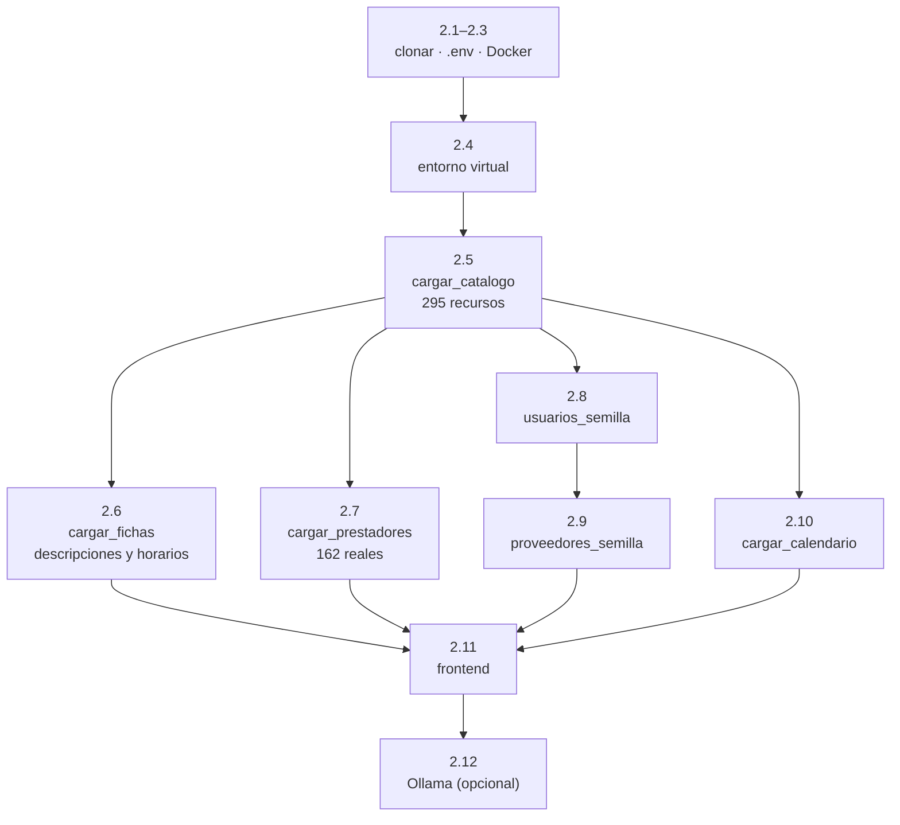

# 13 — Instalación y operación

**Qué explica este archivo:** cómo levantar todo desde cero, las cuentas de
prueba, qué hacer cuando algo falla y los comandos del día a día.

La guía paso a paso completa está en el **`README.md`** del repositorio, que
es la puerta de entrada. Este archivo es el **resumen operativo** y el manual
de averías.

---

## Levantar todo, en cuatro comandos

Si ya está instalado y solo hay que arrancarlo tras apagar el equipo:

```bash
docker compose up -d
```

```bash
cd backend && .venv/Scripts/python.exe -m uvicorn app.main:aplicacion --port 8000
```

```bash
cd frontend && npm run dev
```

Ollama arranca solo con Windows. Si no: `ollama serve`.

| Servicio | Dirección |
|---|---|
| Aplicación | `http://localhost:5173` |
| API | `http://localhost:8000` |
| Documentación de la API | `http://localhost:8000/docs` |
| Ollama | `http://localhost:11434` |

**Comprobar que todo va:**

```bash
curl http://localhost:8000/api/salud
```

Dice el estado de los tres componentes. Es lo primero que hay que mirar cuando
algo no funciona.

---

## Instalación desde cero

Los pasos completos están en el `README.md`, sección 2. El resumen del orden,
que **importa**:



**El catálogo va primero**: las fichas, los horarios y las valoraciones cuelgan
de él. Los usuarios antes que los proveedores, porque un proveedor de
demostración se asocia a una cuenta.

### Los guiones de carga

| Comando | Qué hace | Idempotente |
|---|---|---|
| `python -m app.utilidades.cargar_catalogo` | 295 recursos del CSV | Sí, por código MINCETUR |
| `python -m app.utilidades.cargar_fichas` | Descripciones, horarios, visitantes, fechas de fiestas | Sí |
| `python -m app.utilidades.cargar_prestadores` | 162 prestadores reales | Sí, por RUC |
| `python -m app.utilidades.usuarios_semilla` | 5 cuentas de prueba | Sí |
| `python -m app.utilidades.proveedores_semilla` | 5 proveedores de demostración | Sí |
| `python -m app.utilidades.cargar_calendario --desde 2026 --hasta 2028` | 69 festividades | Sí |
| `python -m app.utilidades.preparar_red_vial` | Red vial de OpenStreetMap | Sí |
| `python -m app.utilidades.descargar_dem` | Modelo de elevación | Sí |

**Todos se pueden ejecutar las veces que haga falta.** Ninguno duplica.

`cargar_fichas` tarda ~5 minutos la primera vez —295 páginas, una por segundo—
y **cero** las siguientes: guarda cada página en disco.

---

## Las cuentas

**Contraseña para todas: `RutaViva2026`**

| Correo | Rol | Para qué sirve |
|---|---|---|
| `administrador@rutavivamantaro.pe` | administrador | Acceso total |
| `gestor@rutavivamantaro.pe` | gestor | **El panel**: evidencia e indicadores |
| `operador@rutavivamantaro.pe` | operador | Ver todas las solicitudes |
| `proveedor@rutavivamantaro.pe` | proveedor | **Responder y confirmar solicitudes** |
| `visitante@rutavivamantaro.pe` | visitante | Guardar viajes |

**Son credenciales de desarrollo, y están escritas a propósito** para que
cualquiera pueda levantar el proyecto. El guion `usuarios_semilla` **se niega a
ejecutarse** si `ENTORNO` del `.env` no dice `desarrollo`.

**Importante para la demostración:** armar un viaje, ver recomendaciones,
armar el itinerario y valorar **no requieren cuenta**. Es una promesa del
proyecto, y conviene enseñarlo así.

---

## El `.env`

```env
POSTGRES_USUARIO=rutaviva
POSTGRES_CONTRASENA=…
POSTGRES_BASE=rutavivamantaro
POSTGRES_HOST=localhost
POSTGRES_PUERTO=5432

ENTORNO=desarrollo
CLAVE_SECRETA=…            # python -c "import secrets; print(secrets.token_urlsafe(48))"
MINUTOS_EXPIRACION_TOKEN=1440

OLLAMA_URL=http://localhost:11434
OLLAMA_MODELO=qwen2.5:7b-instruct

USAR_MODELO_RECOMENDACION=true
USAR_MODELO_AFLUENCIA=true
USAR_MODELO_SENTIMIENTO=true

VITE_URL_API=http://localhost:8000
```

**El `.env` nunca se sube.** Está en `.gitignore` desde el primer commit. Lo
que sí se sube es `.env.ejemplo`, con marcadores en vez de valores.

Los tres interruptores de modelo son la **regla de oro** hecha configuración.
Ver [07](07-inteligencia-artificial.md).

---

## Cuando algo falla

### La API no responde

```bash
curl http://localhost:8000/api/salud
```

Si no contesta nada, uvicorn no está. Si contesta con `base_datos:
no_disponible`, es Docker.

**Un proceso huérfano ocupando el puerto 8000** pasó de verdad: un `uvicorn`
que sobrevivió a su padre seguía sirviendo código viejo. Se mata por PID:

```powershell
Get-NetTCPConnection -LocalPort 8000 -State Listen | ForEach-Object { Stop-Process -Id $_.OwningProcess -Force }
```

### Vite sirve un módulo vacío

Su caché se corrompe de vez en cuando. Mátalo, borra `node_modules/.vite` y
arráncalo otra vez.

### El asistente dice que no está disponible

```bash
curl http://localhost:8000/api/asistente/estado
```

El campo `motivo` dice qué falta: que Ollama no esté arrancado, o que falte el
modelo (`ollama pull qwen2.5:7b-instruct`).

**El resto de la aplicación funciona igual.** El asistente es opcional.

### Las pruebas se saltan en masa

Significa que PostgreSQL no está levantado. `docker compose up -d`.

### Alembic no detecta un cambio

**Alembic no ve los cambios en las restricciones `CHECK`.** Hay que escribirlos
a mano en la migración. Pasó al hacer `mes` nulable: la columna cambió pero el
`CHECK` seguía exigiendo 1–12.

---

## El día a día

```bash
# Migraciones
.venv/Scripts/python.exe -m alembic upgrade head
.venv/Scripts/python.exe -m alembic revision --autogenerate -m "descripcion"
.venv/Scripts/python.exe -m alembic downgrade -1

# Base de datos
docker compose up -d
docker compose down          # conserva los datos
docker compose down -v       # BORRA los datos
docker exec -it rutaviva_postgres psql -U rutaviva -d rutavivamantaro
```

---

## Qué NO se sube al repositorio

`.gitignore` cubre: `.env`, `__pycache__/`, `*.py[cod]`, `node_modules/`,
`.venv/`, `dist/`, y bajo `backend/datos/`: `crudos/`, `derivados/`,
`cache_osm/`, `dem/`, **`fichas/`** (~30 MB de HTML) y **`prestadores/`**.

Todo eso se vuelve a descargar con los guiones de carga. El repositorio guarda
**las instrucciones para obtener los datos, no los datos**.

---

## Relacionado

- `README.md` — la guía completa paso a paso
- [12 — Pruebas y calidad](12-pruebas-y-calidad.md)
- [14 — Guion de defensa](14-guion-de-defensa.md)
