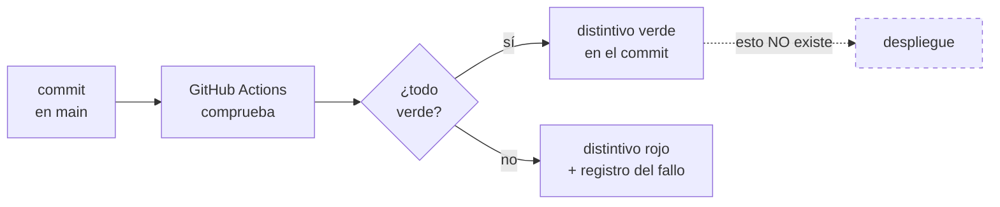
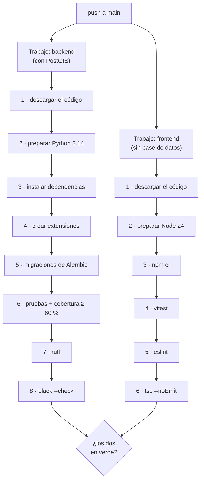
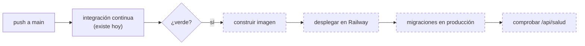

# 17 — Integración y despliegue

**Qué explica este archivo:** cómo se comprueba hoy que el proyecto está sano
—a mano y de forma automática—, en qué se diferencian las dos formas, y qué
haría falta para desplegarlo de verdad.

La última sección es la más importante para la defensa, porque es la que dice
**lo que no se puede hacer**.

---

## Lo primero, para que no haya malentendidos

Esto es **integración continua**, no entrega continua.

El flujo comprueba que el código está sano y ahí se detiene. **No despliega
nada, en ningún sitio.** No hay servidor, no hay dominio, no hay nada
publicado. La aplicación corre en la laptop.



Por qué no existe ese último paso está al final, en «[Qué haría falta para
desplegar de verdad](#qué-haría-falta-para-desplegar-de-verdad)».

---

## El procedimiento MANUAL, tal como se hace hoy en la laptop

Esto es lo que se ejecuta antes de cada commit. Orden real, órdenes reales.

### 1. Levantar la base de datos

```bash
docker compose up -d
```

Levanta `postgis/postgis:16-3.4` con el nombre `rutaviva_postgres`. Tarda unos
**12 segundos** en pasar a *healthy*, que es cuando `pg_isready` responde de
verdad y no solo cuando el proceso arranca.

La primera vez que se crea la base —y solo la primera— Docker ejecuta
`backend/scripts_sql/99_extensiones.sql`, montado en
`/docker-entrypoint-initdb.d/`, que instala `postgis`, `unaccent` y `pg_trgm`
y borra el geocodificador del censo de Estados Unidos que trae la imagen.

Comprobar que está arriba:

```bash
docker ps --format "{{.Names}} :: {{.Status}}"
```

### 2. Aplicar las migraciones, si hay alguna nueva

```bash
cd backend && .venv/Scripts/python.exe -m alembic upgrade head
```

En el día a día esto aplica **la última** migración sobre una base que ya
tiene las diez anteriores. Retenlo: es la diferencia principal con lo que hace
la máquina automática.

### 3. Las pruebas del backend

```bash
cd backend && .venv/Scripts/python.exe -m pytest -q
```

**550 pruebas.** Tarda **3 minutos y 11 segundos** medidos. Desde este cambio,
además, falla si la cobertura baja del 60 %.

Última ejecución completa:

```
549 passed, 1 skipped, 5 warnings in 191.88s (0:03:11)
Required test coverage of 60.0% reached. Total coverage: 73.42%
```

### 4. El estilo del backend

```bash
cd backend && .venv/Scripts/python.exe -m ruff check app/ pruebas/ alembic/
```

```bash
cd backend && .venv/Scripts/python.exe -m black --check app/ pruebas/ alembic/
```

Segundos. `--check` no reformatea: mira y devuelve error.

### 5. El frontend, los cuatro controles

```bash
cd frontend && npx vitest run
```

**148 pruebas**, 14 archivos, **36 segundos**.

```bash
cd frontend && npx eslint src/
```

```bash
cd frontend && npx tsc --noEmit -p tsconfig.app.json
```

```bash
cd frontend && npx prettier --check "src/**/*.{ts,tsx,css,json}"
```

### 6. Y entonces sí, el commit

```bash
git add -A && git commit -m "tipo(alcance): descripcion [brecha-N]" && git push
```

### El problema de todo lo anterior

No es que falle. **Es que no deja constancia.** Nadie puede comprobar,
mirando el repositorio, si estos seis pasos se ejecutaron antes de un commit
concreto o si ese día había prisa. Y depende enteramente de que quien hace el
commit se acuerde.

---

## El procedimiento AUTOMÁTICO

**Archivo:** [`.github/workflows/integracion-continua.yml`](../../.github/workflows/integracion-continua.yml)

### Qué lo dispara

| Suceso | Cuándo ocurre en este proyecto |
|---|---|
| `push` a `main` | **En cada commit.** Es el caso real: el proyecto no usa ramas (regla 1.4) |
| `pull_request` contra `main` | Hoy nunca. Está por lo que pide la asignatura y porque cuesta una línea |

Además hay una regla de simultaneidad: si se suben dos commits seguidos, la
comprobación del primero **se cancela**. Lo que interesa es si el último
estado del código está sano, no arrastrar ejecuciones que ya no responden a
ninguna pregunta.

### La estructura: dos trabajos en paralelo



Van en trabajos separados por dos razones: **corren a la vez**, así que el
tiempo total es el del más lento y no la suma; y el frontend **no necesita
base de datos**, así que no tiene por qué esperar a que PostGIS arranque.

Si cualquiera de los dos falla, la ejecución entera sale en rojo.

### Qué verifica cada paso, y por qué está

#### Trabajo «backend»

| Paso | Qué verifica de verdad |
|---|---|
| **1 · Descargar el código** | Nada por sí solo. Sin esto no hay proyecto |
| **2 · Preparar Python 3.14** | Que el proyecto funciona con **la misma versión** que la laptop, no con la que traiga la máquina |
| **3 · Instalar dependencias** | **Que el proyecto se instala desde cero.** Si `pyproject.toml` se hubiera quedado sin declarar algo que en la laptop está instalado «de antes», aquí se cae |
| **4 · Crear las extensiones** | Que `postgis`, `unaccent` y `pg_trgm` se instalan aplicando **el archivo real del repositorio** |
| **5 · Migraciones de Alembic** | **La cadena entera desde una base vacía.** Esto la laptop no lo comprueba nunca |
| **6 · pytest con cobertura** | Las 550 pruebas **y** que la cobertura no bajó del 60 % |
| **7 · ruff** | Imports sin usar, nombres indefinidos, orden de imports, trampas frecuentes |
| **8 · black --check** | Que el formato es el que black produciría. Va al final a propósito: un fallo de formato no debe esconder uno real |

**Los pasos 3 y 5 son los que justifican todo esto.** Son las dos cosas que un
control manual no comprueba nunca, porque en la laptop las dependencias ya
están instaladas y la base ya tiene el esquema.

El paso 5 no es teórico en este proyecto: ya hubo que **escribir a mano** el
cambio de una restricción `CHECK` porque Alembic no las detecta (ver
[15](15-historial-de-fallos.md)). Una migración editada a mano es exactamente
la clase de cosa que puede quedar rota sin que nadie se entere.

#### Trabajo «frontend»

| Paso | Qué verifica de verdad |
|---|---|
| **1 · Descargar el código** | **El repositorio completo, no solo `frontend/`** (ver el aviso de abajo) |
| **2 · Preparar Node 24** | La misma versión mayor que la laptop |
| **3 · `npm ci`** | Que se instala **exactamente** lo que dice `package-lock.json`. No `npm install`, que podría actualizar el lock y hacer que dos ejecuciones instalen cosas distintas |
| **4 · vitest** | Las 148 pruebas de componentes y utilidades |
| **5 · eslint** | Reglas de los ganchos de React, que son las que cazan fallos reales aquí |
| **6 · `tsc --noEmit`** | Los tipos, en modo estricto, sin generar archivos |

> ⚠️ **El trabajo del frontend no puede usar una descarga parcial del
> repositorio.** La prueba `utilidades/avisos.prueba.ts` abre el archivo Python
> `backend/app/servicios/avisos.py` y lee de ahí los 67 códigos de aviso, para
> comprobar que todos tienen su frase en español y en inglés. Si alguien añade
> una descarga parcial para ir más rápido, esa prueba se cae.

### Lo que hay aquí y no está en la laptop

Un paso, el 4. En local, Docker aplica `99_extensiones.sql` solo, montándolo
en `/docker-entrypoint-initdb.d/`. En GitHub **no se puede**: el contenedor
del servicio arranca *antes* de que exista el código descargado, así que no
hay ningún archivo que montar.

Se aplica a mano con `psql`, y se aplica **el archivo real del repositorio**
en vez de copiar sus órdenes dentro del flujo: si mañana se añade una
extensión, este paso la recoge solo y no hay que acordarse de tocar dos sitios.

### Por qué la CI mide algo menos de cobertura que la laptop

Porque **no tiene la red vial descargada**. Son 28 MB que el repositorio no
guarda, por la decisión de guardar *las instrucciones para obtener los datos,
no los datos*. Sin ella, los traslados se calculan en línea recta y unas
cuantas líneas de `red_vial.py` no se recorren.

**Las pruebas pasan igual**, y el motivo es interesante: el sistema está
escrito para admitir las dos situaciones **y decir cuál usó**.
`origen_del_calculo` vale `red_vial` o `linea_recta`, y las pruebas afirman
sobre ese campo en vez de dar por hecho que hay red.

> Es la primera vez que la honestidad del sistema sobre lo que sabe y lo que
> estima da un beneficio de ingeniería y no solo de discurso: **es lo que
> permite probar el proyecto en una máquina que no tiene los datos.**

---

## Los dos procedimientos, comparados

| | **Manual** | **Automático** |
|---|---|---|
| **Quién lo ejecuta** | Yo, escribiendo las órdenes | GitHub Actions, en sus máquinas |
| **Cuándo** | Cuando me acuerdo, antes de un commit | En cada push y cada propuesta de cambio a `main`. Siempre |
| **Dónde** | Windows 11, con todo ya instalado y los datos descargados | Ubuntu recién creado, sin nada |
| **Base de datos** | La real, con los 295 recursos dentro | Un contenedor vacío que se destruye al terminar |
| **Migraciones** | La última, sobre un esquema que ya existe | **Las 11, desde cero** |
| **Dependencias** | Ya instaladas hace meses | **Se instalan desde `pyproject.toml`** en cada ejecución |
| **Qué evidencia deja** | **Ninguna.** Lo que salió por la terminal y se perdió | Registro completo por paso, con fecha, guardado en GitHub, y distintivo verde o rojo junto al commit |
| **Cuánto tarda** | **~4 min** medidos (3:11 pytest + 0:36 vitest + el resto) | **3 min 3 s** medidos en la primera ejecución. Los dos trabajos van en paralelo, así que manda el más lento |
| **Se puede saltar** | Sí, sin dejar rastro | No |
| **Qué comprueba de más** | Prettier, y con la red vial completa | Instalación desde cero, migraciones desde vacío |
| **Qué comprueba de menos** | — | Prettier, el asistente con Ollama, el modelo de sentimiento |

### Sobre la fila «cuánto tarda»

Los dos están medidos. El manual, en esta laptop. El automático, en la
**primera ejecución real** del flujo:
[run 33940471717](https://github.com/75220834-cloud/PROYECTO-PROCESOS-DE-SOFTWARE-/actions/runs/33940471717),
disparada por el push de `bc17ea7`, **verde al primer intento**.

| Trabajo | Duración | Paso más caro |
|---|---|---|
| Backend | **177 s** | Instalar dependencias (55 s) y pruebas (81 s) |
| Frontend | **31 s** | Pruebas de vitest (7 s) |
| **Total de la ejecución** | **3 min 3 s** | Los dos trabajos corren a la vez |

Desglose del trabajo del backend, que es el que manda:

| Paso | Tiempo |
|---|---|
| Levantar el contenedor de PostGIS | 27 s |
| Descargar el código | 1 s |
| Preparar Python 3.14 | 1 s |
| **Instalar las dependencias** | **55 s** |
| Crear las extensiones | 1 s |
| **Las 11 migraciones desde vacío** | **1 s** |
| **Las 550 pruebas con cobertura** | **81 s** |
| ruff | < 1 s |
| black `--check` | 2 s |

Dos cosas llaman la atención en esa tabla, y las dos son buenas noticias:

**Las pruebas tardan 81 s en GitHub y 191 s en la laptop.** No es que la
máquina de GitHub sea el doble de rápida: es que **no tiene la red vial
descargada**, así que los traslados se calculan en línea recta en vez de
recorrer un grafo de 28 MB. Es el mismo motivo por el que allí la cobertura
sale algo más baja.

**Instalar las dependencias cuesta más que ejecutar todas las pruebas.** Esos
55 s bajarán en las siguientes ejecuciones, porque `cache: pip` guarda las
descargas de una ejecución a la siguiente.

---

## Qué haría falta para desplegar de verdad

Aquí empieza la parte incómoda. La respuesta corta es que **hoy no se puede
desplegar este proyecto completo en ningún plan gratuito**, y conviene decirlo
así en vez de enseñar media aplicación diciendo que está desplegada.

### Cómo sería la cadena, si existiera



Lo punteado es lo que no existe. Railway se conecta a un repositorio de GitHub
y despliega solo en cada push, así que la integración con GitHub es la parte
**fácil**: se autoriza el repositorio y se elige la rama. El problema no es
ese.

### Lo que sí haría falta escribir

| Pieza | Estado |
|---|---|
| `Dockerfile` del backend | **No existe.** Hoy no hay ninguno: el backend corre en un entorno virtual sobre Windows |
| `Dockerfile` o construcción del frontend | El guion `npm run construir` ya existe; falta servir el `dist/` |
| Variables de entorno en el proveedor | Las mismas del `.env`, con una `CLAVE_SECRETA` **nueva**, distinta de la de desarrollo |
| Migraciones al desplegar | `alembic upgrade head` como paso de arranque |
| Carga inicial de datos | Los seis guiones, **una vez**, contra la base de producción |
| `ENTORNO=produccion` | Y con eso, `usuarios_semilla` se niega a ejecutarse solo. Ya está programado así |

### Las limitaciones reales, una por una

#### 1. PostGIS no viene con el PostgreSQL de los proveedores

La plantilla estándar de PostgreSQL de Railway —y de casi todos— **no trae
PostGIS**. Y este proyecto no funciona sin él: la ubicación de cada recurso es
`GEOGRAPHY(POINT, 4326)`, las búsquedas por radio usan índices GIST, y el
asistente depende de `unaccent`.

**Se puede resolver**, desplegando `postgis/postgis:16-3.4` como servicio con
imagen propia en vez de usar la plantilla. Pero entonces se pierde lo que hace
atractiva la plantilla: copias de seguridad automáticas, actualizaciones
gestionadas y soporte. Se pasa a administrar la base uno mismo.

Y hay un detalle que la CI ya destapó: `99_extensiones.sql` **solo se ejecuta
la primera vez que se crea la base**. En un despliegue hay que acordarse de
aplicarlo a mano, exactamente igual que en el paso 4 del flujo.

#### 2. Los 4,4 GB de Ollama no caben en ningún plan gratuito

Esta es la limitación que no tiene arreglo.

| El problema | El número |
|---|---|
| Tamaño del modelo `qwen2.5:7b-instruct` | **4,4 GB** |
| Memoria que necesita para responder | ~6–8 GB de RAM |
| Lo que tarda **en esta laptop**, con su CPU | **25–40 segundos** por respuesta |
| Lo que tardaría en un vCPU compartido de un plan barato | Peor. Bastante peor |

No es solo el disco: es que la inferencia sin GPU es lenta, y un contenedor
económico da menos CPU que una laptop. Un asistente que tarda más de un minuto
en contestar no es un asistente que se pueda enseñar.

**Conclusión honesta: el asistente quedaría desactivado en producción.**

Lo bueno es que **eso ya está previsto y programado**, no habría que tocar
nada. La interfaz consulta `GET /api/asistente/estado` al abrir el panel, y si
Ollama no responde muestra el motivo y un enlace al formulario de
preferencias:

```tsx
// frontend/src/componentes/PanelConversacion.tsx
const noDisponible = estado !== undefined && !estado.disponible;
```

```tsx
<Link to="/preferencias" onClick={() => setAbierto(false)}>
  {t('conversacion.usarFormulario')}
</Link>
```

Y no se pierde ninguna funcionalidad, porque **el asistente no cierra ninguna
brecha**: es capa de interacción sobre las cinco funciones del backend, que
siguen estando disponibles por el formulario de seis pasos. Está razonado en
[08](08-asistente-conversacional.md) y en su nota de decisión.

#### 3. Los datos pesados tampoco están en el repositorio

Ni la red vial (28 MB), ni el modelo de elevación, ni las 295 fichas
descargadas, ni los CSV del directorio. Están en `.gitignore` a propósito.

Un despliegue real tendría que ejecutar los guiones de carga **en el servidor,
una vez**, y guardar el resultado en un volumen persistente. `cargar_fichas`
tarda unos 5 minutos pidiendo 295 páginas al MINCETUR, una por segundo. Sin
volumen persistente, ese trabajo se repetiría en cada despliegue, lo cual
sería además una falta de respeto hacia el servidor del que se descarga.

Sin la red vial, la aplicación **funciona igual pero peor**: todos los
traslados se estiman en línea recta y el sistema lo dice. Degradarse diciéndolo
es mejor que caerse, pero sigue siendo degradarse.

#### 4. El plan gratuito

Railway **retiró su nivel gratuito permanente**: lo que ofrece es un crédito
de prueba limitado, y después hay que pagar. Las condiciones exactas cambian
cada cierto tiempo, así que **hay que mirarlas el día que se vaya a decidir**
en vez de citar de memoria un número que puede estar obsoleto.

Y hay algo más definitivo que el precio: **«servicios de nube de pago» está en
la lista de lo prohibido del plan de trabajo** (regla 1.10). Aunque el
presupuesto diera, desplegar en un plan de pago iría contra una restricción
declarada del proyecto.

### La conclusión, en una frase para la defensa

> **Se puede desplegar el catálogo, las recomendaciones, los itinerarios, la
> coordinación y el tablero. No se puede desplegar el asistente. Y ninguna de
> las dos cosas se ha hecho, porque desplegar exige un plan de pago que el
> propio plan de trabajo prohíbe.**

Lo que sí existe, y es lo que pedía el profesor, es la **integración
continua**: la comprobación automática de que el código está sano, en cada
commit, con registro público.

---

## Lo que sigue siendo manual, y por qué

Resumen; el razonamiento completo está en la [nota de decisión del 4 de
septiembre](../decisiones/2026-09-04-que-se-automatizo-y-que-sigue-siendo-manual.md).

| Actividad | Por qué no se automatiza |
|---|---|
| **Cargar los datos** | Descargan del MINCETUR, OpenStreetMap y Copernicus. Hacerlo en cada push sería pegarle a servidores del Estado por una coma |
| **Probar con las manos** | **Es lo que más fallos ha encontrado.** El botón muerto, el itinerario duplicado y el asistente negando Concepción no los cazó ninguna prueba |
| **El asistente con Ollama** | 4,4 GB. Sus 33 pruebas ya corren sin él |
| **El modelo de sentimiento** | PyTorch (~2,5 GB) y descarga el modelo por red. Se salta **una** prueba; el módulo se queda en 96 % |
| **SonarQube** | Preparado y no ejecutado, como pide el plan. Exige servidor y token |
| **Prettier** | Riesgo de fallar por finales de línea, no por calidad. Se deja fuera **y se dice** |
| **El despliegue** | No existe. Ver arriba |

> Que las pruebas del asistente y las del sentimiento corran sin sus modelos no
> es suerte: es la **regla de oro (1.6)** —cada funcionalidad con modelo tiene
> su alternativa por reglas— dando un beneficio que no se buscaba cuando se
> escribió. Permite comprobar el proyecto entero sin descargar un solo modelo.

---

## Relacionado

- [12 — Pruebas y calidad](12-pruebas-y-calidad.md)
- [13 — Instalación y operación](13-instalacion-y-operacion.md)
- [15 — Historial de fallos](15-historial-de-fallos.md)
- [16 — Pendientes y limitaciones](16-pendientes-y-limitaciones.md)
- [Qué se automatizó y qué sigue siendo manual](../decisiones/2026-09-04-que-se-automatizo-y-que-sigue-siendo-manual.md)
